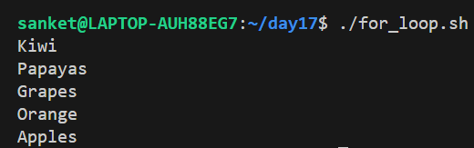
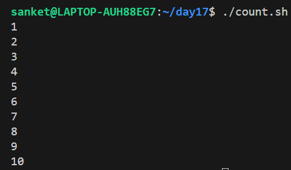
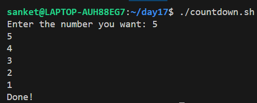
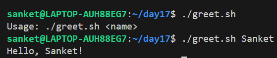
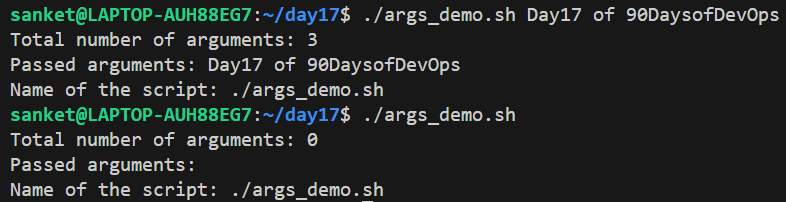
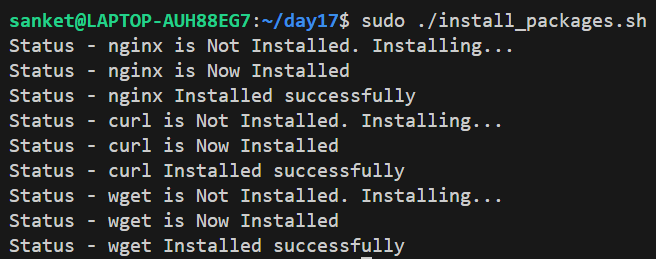
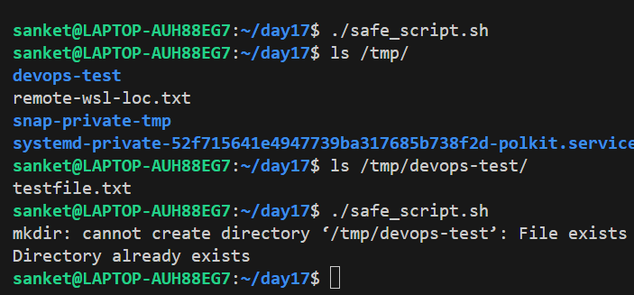
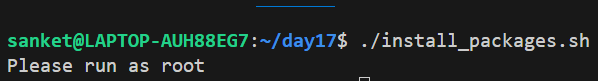

# Day 17 – Shell Scripting: Loops, Arguments & Error Handling

## Task 1: For Loop
1. Create `for_loop.sh` that:
   - Loops through a list of 5 fruits and prints each one
   
   [Script](scripts/for_loop.sh)
   
   

2. Create `count.sh` that:
   - Prints numbers 1 to 10 using a for loop
   
   [Script](scripts/count.sh)
   
   

---

## Task 2: While Loop
1. Create `countdown.sh` that:
   - Takes a number from the user
   - Counts down to 0 using a while loop
   - Prints "Done!" at the end

   [Script](scripts/countdown.sh)
   
   
   
---

## Task 3: Command-Line Arguments
1. Create `greet.sh` that:
   - Accepts a name as `$1`
   - Prints `Hello, <name>!`
   - If no argument is passed, prints "Usage: ./greet.sh <name>"
   
   [Script](scripts/greet.sh)
   
   

2. Create `args_demo.sh` that:
   - Prints total number of arguments (`$#`)
   - Prints all arguments (`$@`)
   - Prints the script name (`$0`)
   
   [Script](scripts/args_demo.sh)
   
   

---

## Task 4: Install Packages via Script
1. Create `install_packages.sh` that:
   - Defines a list of packages: `nginx`, `curl`, `wget`
   - Loops through the list
   - Checks if each package is installed (use `dpkg -s` or `rpm -q`)
   - Installs it if missing, skips if already present
   - Prints status for each package
   
   [Script](scripts/install_packages.sh)
   
   

---

## Task 5: Error Handling
1. Create `safe_script.sh` that:
   - Uses `set -e` at the top (exit on error)
   - Tries to create a directory `/tmp/devops-test`
   - Tries to navigate into it
   - Creates a file inside
   - Uses `||` operator to print an error if any step fails
   
   [Script](scripts/safe_script.sh)
   
   

2. Modify your `install_packages.sh` to check if the script is being run as root — exit with a message if not.

   [Script](scripts/modified_install_packages.sh)
   
   

---

## What I Learned

* Used for loops to iterate over lists and number ranges
* Used while loops for countdown logic with user input
* Handled command-line arguments using $1, $#, $@, $0
* Added usage messages for missing arguments
* Took user input using read
* Automated package installation (nginx, curl, wget)
* Checked package status using dpkg -s
* Added root user validation using $EUID
* Implemented error handling with set -e and ||
* Created safe scripts to avoid failures and overwrites
* Issue Faced & Lesson Learned: Used commas in a Bash array, causing the loop to fail, Learned that Bash arrays must be space-separated, not comma-separated
