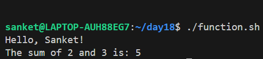
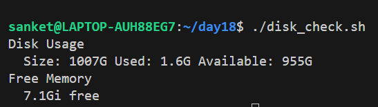
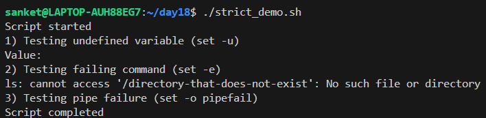
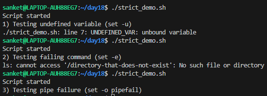
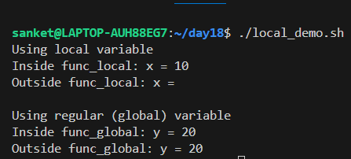
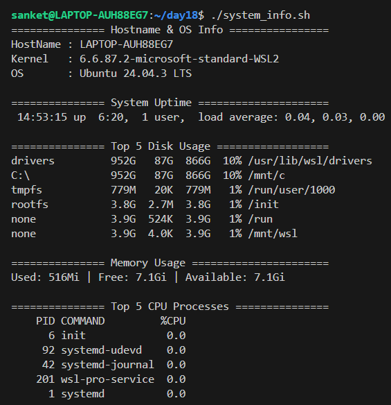

# Day 18 – Shell Scripting: Functions & Slightly Advanced Concepts

## Task 1: Basic Functions
1. Create `functions.sh` with:
   - A function `greet` that takes a name as argument and prints `Hello, <name>!`
   - A function `add` that takes two numbers and prints their sum
   - Call both functions from the script
   
   [Script](scripts/functions.sh)
   
   

---

## Task 2: Functions with Return Values
1. Create `disk_check.sh` with:
   - A function `check_disk` that checks disk usage of `/` using `df -h`
   - A function `check_memory` that checks free memory using `free -h`
   - A main section that calls both and prints the results
   
   [Script](scripts/disk_check.sh)
   
   

---

## Task 3: Strict Mode — `set -euo pipefail`
1. Create `strict_demo.sh` with `set -euo pipefail` at the top
2. Try using an **undefined variable** — what happens with `set -u`?
3. Try a command that **fails** — what happens with `set -e`?
4. Try a **piped command** where one part fails — what happens with `set -o pipefail`?

**Document:** What does each flag do?
- `set -e` → Exit the script immediately if any command fails.
- `set -u` → Exit the script if an undefined (unset) variable is used.
- `set -o pipefail` → Pipeline fails if any command fails.

   [Script](scripts/strict_demo.sh)
   
   
   
   
   
---

## Task 4: Local Variables
1. Create `local_demo.sh` with:
   - A function that uses `local` keyword for variables
   - Show that `local` variables don't leak outside the function
   - Compare with a function that uses regular variables
   
   [Script](scripts/local_demo.sh)
   
   

---

## Task 5: Build a Script — System Info Reporter
Create `system_info.sh` that uses functions for everything:
1. A function to print **hostname and OS info**
2. A function to print **uptime**
3. A function to print **disk usage** (top 5 by size)
4. A function to print **memory usage**
5. A function to print **top 5 CPU-consuming processes**
6. A `main` function that calls all of the above with section headers
7. Use `set -euo pipefail` at the top

   [Script](scripts/system_info.sh)
   
   

---

## What I Learned

**Functions & Modularity** – Learned to create reusable, organized code blocks.This makes scripts cleaner, easier to read, and simpler to maintain.

**System Monitoring Scripts** – Explored fetching system info like memory,disk usage,and CPU processes.Useful for building quick automation for system health checks.

**Error Handling & Safety** – Using `set -euo pipefail` to catch undefined variables,failing commands,and pipeline errors early,making scripts more reliable.

**Variable Scope** – Understood the difference between local and global variables. Local variables stay inside functions, while global variables affect the wider script.

**Practical Automation** – Using a main function to orchestrate tasks helps make scripts modular,maintainable,and automation-friendly.

**Function Naming Pitfall** – Faced an issue where naming a function the same as a system command (uptime) caused an infinite loop.
Learned to avoid using system command names for functions.
