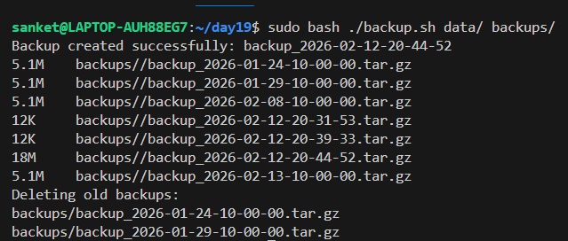
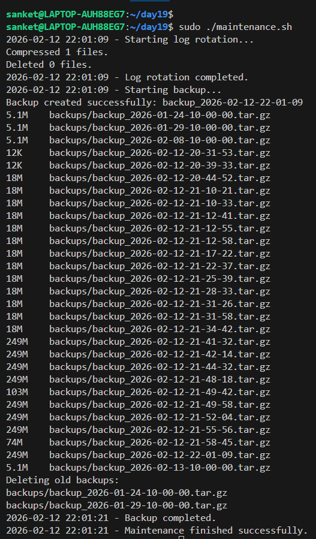

# Day 19 – Shell Scripting Project: Log Rotation, Backup & Crontab

## Task 1: Log Rotation Script
Create `log_rotate.sh` that:
1. Takes a log directory as an argument (e.g., `/var/log/myapp`)
2. Compresses `.log` files older than 7 days using `gzip`
3. Deletes `.gz` files older than 30 days
4. Prints how many files were compressed and deleted
5. Exits with an error if the directory doesn't exist

   [Script](scripts/log_rotate.sh)
   
   
   
---

## Task 2: Server Backup Script
Create `backup.sh` that:
1. Takes a source directory and backup destination as arguments
2. Creates a timestamped `.tar.gz` archive (e.g., `backup-2026-02-08.tar.gz`)
3. Verifies the archive was created successfully
4. Prints archive name and size
5. Deletes backups older than 14 days from the destination
6. Handles errors — exit if source doesn't exist

   [Script](scripts/backup.sh)
   
   
   
---

## Task 3: Crontab
1. Read: `crontab -l` — what's currently scheduled?
2. Understand cron syntax:
   ```
   * * * * *  command
   │ │ │ │ │
   │ │ │ │ └── Day of week (0-7)
   │ │ │ └──── Month (1-12)
   │ │ └────── Day of month (1-31)
   │ └──────── Hour (0-23)
   └────────── Minute (0-59)
   ```
3. Cron entries for:
   - Run `log_rotate.sh` every day at 2 AM     : `0 2 * * *`
   - Run `backup.sh` every Sunday at 3 AM      : `0 3 * * 7`
   - Run a health check script every 5 minutes : `*/5 * * * *`

---

## Task 4: Combine — Scheduled Maintenance Script
Create `maintenance.sh` that:
1. Calls your log rotation function
2. Calls your backup function
3. Logs all output to `/var/log/maintenance.log` with timestamps
4. Write the cron entry to run it daily at 1 AM : `0 1 * * *`

   [Script](scripts/maintenance.sh)
   
   
   
   
   
---

## What I learned

* Validation: Used if [ ! -d "$DIR" ] to prevent scripts from running on missing paths.

* Arguments: Mastered $1, $2, and $# to create dynamic,reusable scripts.

* Advanced File Handling: find command: Combined -mtime, -exec, and -delete for automated file cleanup.

* Compression: Used tar and gzip to compress large files and keep the server from running out of disk space.

* Understood the cron syntax (* * * * *) to schedule tasks during off-peak hours (e.g., 1 AM `0 1 * * *` )  .

* Combined log rotation and backups into one maintenance.sh script to keep the crontab organized and easy to manage.

* Tee Command: Implemented tee to view real-time output while saving to a log file.