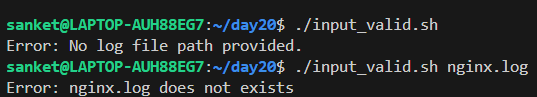
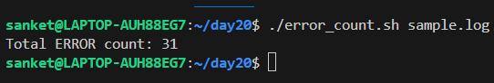
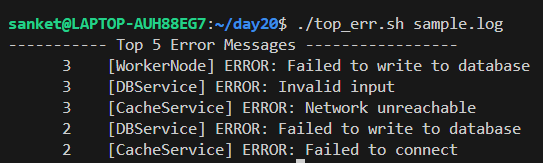
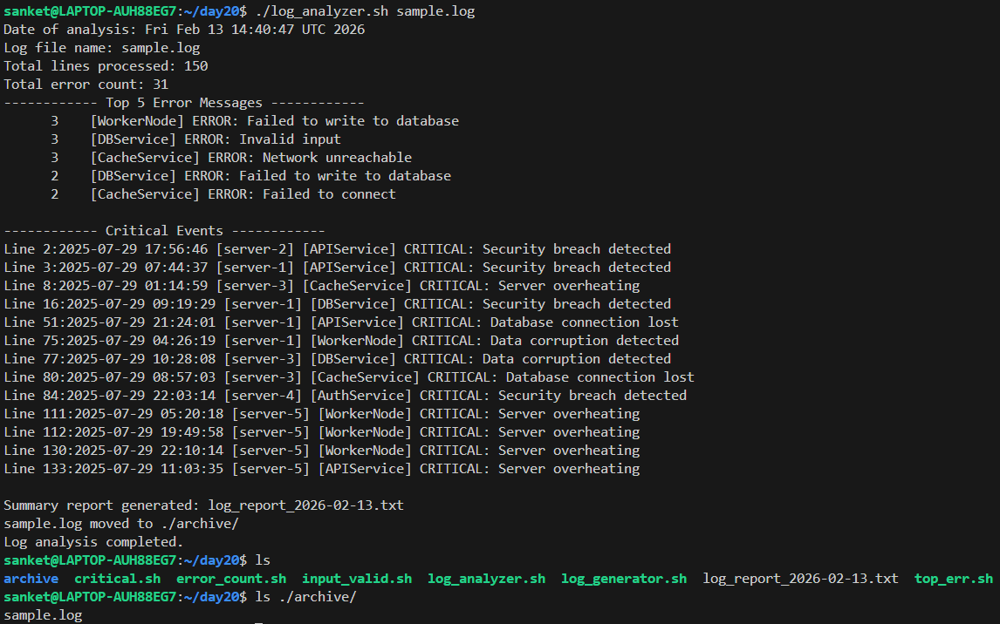

# Day 20 – Bash Scripting Challenge: Log Analyzer and Report Generator

## Challenge Tasks

### Task 1: Input and Validation
Your script should:
1. Accept the path to a log file as a command-line argument
2. Exit with a clear error message if no argument is provided
3. Exit with a clear error message if the file doesn't exist

   [Script](scripts/input_valid.sh)
   
   

---

### Task 2: Error Count
1. Count the total number of lines containing the keyword `ERROR` or `Failed`
2. Print the total error count to the console

   [Script](scripts/error_count.sh)
   
   

---

### Task 3: Critical Events
1. Search for lines containing the keyword `CRITICAL`
2. Print those lines along with their line number

   [Script](scripts/error_count.sh)
   
   

---

### Task 4: Top Error Messages
1. Extract all lines containing `ERROR`
2. Identify the **top 5 most common** error messages
3. Display them with their occurrence count, sorted in descending order

   [Script](scripts/top_err.sh)
   
   

---

### Task 5: Summary Report
Generate a summary report to a text file named `log_report_<date>.txt` (e.g., `log_report_2026-02-11.txt`). The report should include:
1. Date of analysis
2. Log file name
3. Total lines processed
4. Total error count
5. Top 5 error messages with their occurrence count
6. List of critical events with line numbers

### Task 6 (Optional): Archive Processed Logs
Add a feature to:
1. Create an `archive/` directory if it doesn't exist
2. Move the processed log file into `archive/` after analysis
3. Print a confirmation message

   [Script](scripts/log_analyzer_report.sh)
   
   

---

## What I learned

* How to break a larger automation problem into smaller focused scripts (input validation,error counting,top errors,critical events)and then combine them into one complete solution.

* How to use core Linux tools (grep, awk, sort, uniq, sed, wc) together to extract meaningful insights from raw log data.

* The importance of defensive scripting — validating inputs and handling missing files before processing.

* How to generate structured summary reports with dynamic filenames using date.

* How to automate post-processing tasks like archiving analyzed logs to keep directories clean and organized.