# Day 23 – Git Branching & Working with GitHub

### Task 1: Understanding Branches
1. What is a branch in Git?
- A branch is a separate line of development in a project.
- Think of it as a copy of the code where you can work on new features.

2. Why do we use branches instead of committing everything to `main`?
- Branches let us work on new features or fixes safely without breaking `main` branch, which always holds the stable,production-ready code.

3. What is `HEAD` in Git?
- `HEAD` is a reference to your current location in the repository.I
- It always points to the latest commit on the branch you are working on.

4. What happens to your files when you switch branches?
- Git updates your project files to look like the branch you switched to.
- Files that exist in the current branch but not in the new branch will disappear temporarily.
- Files that are different in the new branch will be replaced with the new branch version.

---

### Task 2: Branching Commands — Hands-On

1. List all branches in your repo
- `git branch`

     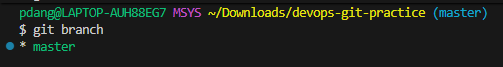

2. Create a new branch called `feature-1`
- `git branch feature-1`

     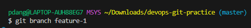

3. Switch to `feature-1`
- `git switch feature-1`
     
     

4. Create a new branch and switch to it in a single command — call it `feature-2`
- `git checkout -b feature-2`

    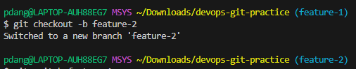


5. Try using `git switch` to move between branches — how is it different from `git checkout`?
- `git switch <branch>`   :only switches branches.  
- `git checkout <branch>` :switches branches and can also restore files.

    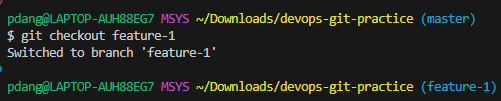

6. Make a commit on `feature-1` that does **not** exist on `main`
- `git commit -m "Add git branch command section to git-commands.md"`

    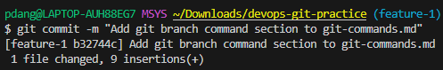

7. Switch back to `main` — verify that the commit from `feature-1` is not there

     

8. Delete a branch you no longer need
- `git branch -d feature-2`

    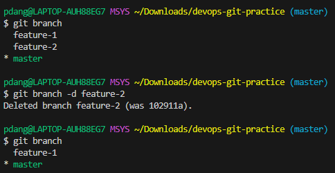

9. Add all branching commands to your `git-commands.md`

---

### Task 3: Push to GitHub
1. Create a **new repository** on GitHub (do NOT initialize it with a README)

    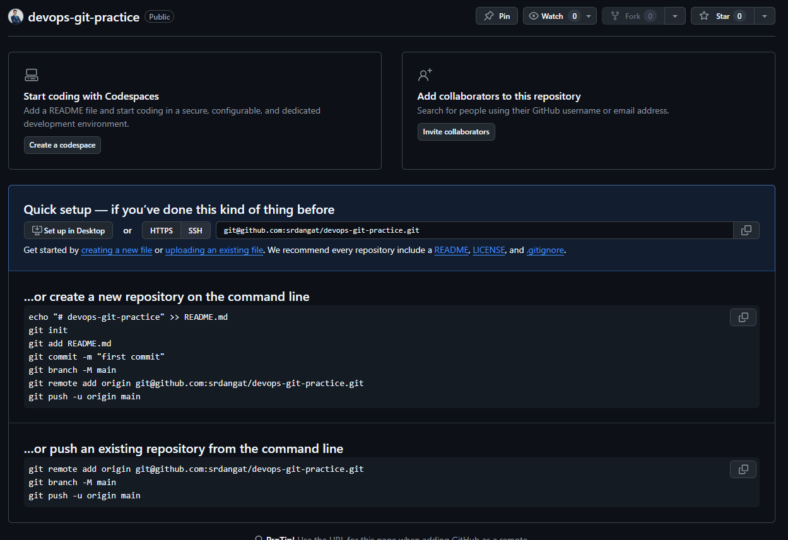    

2. Connect your local `devops-git-practice` repo to the GitHub remote
3. Push your `main` branch to GitHub

    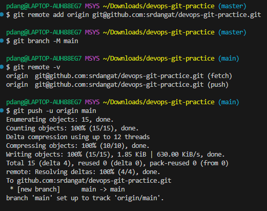

4. Push `feature-1` branch to GitHub

    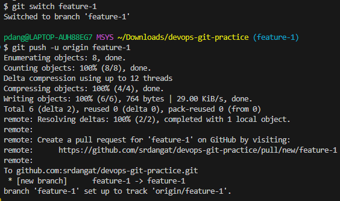


5. Verify both branches are visible on GitHub

    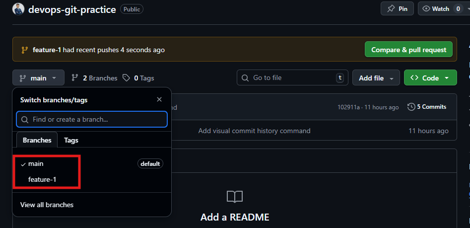

6. What is the difference between `origin` and `upstream`?
- `origin`: origin is the default name for the repo you cloned,points to your own GitHub repository where you push and pull changes.
`example`: https://github.com/srdangat/devops-git-practice.git
- `upstream`: upstream refers to the original repository you forked from.You use it to pull updates from the original project into your fork.
`example`: https://github.com/srdangat/90DaysOfDevOps

---

### Task 4: Pull from GitHub

1. Make a change to a file **directly on GitHub** (use the GitHub editor)

    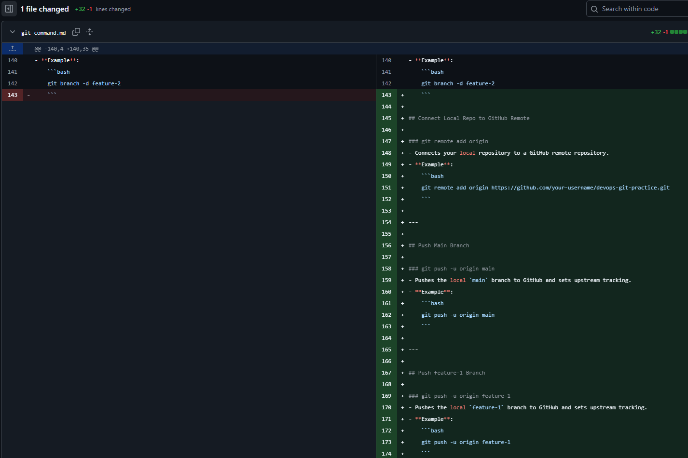

2. Pull that change to your local repo

    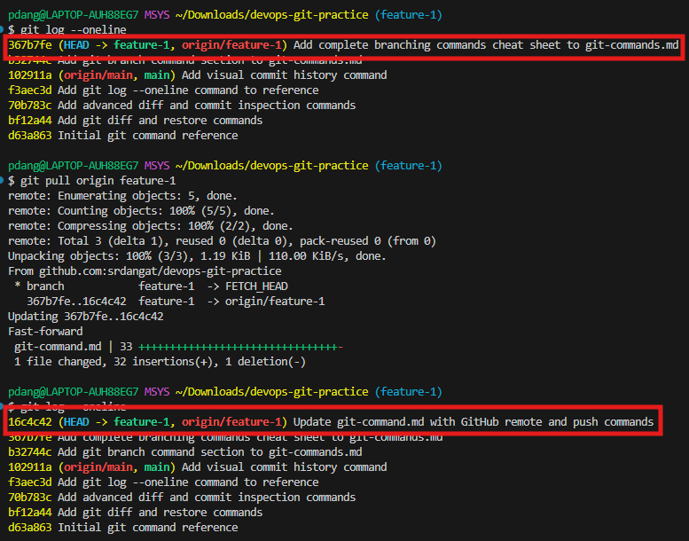

3. What is the difference between `git fetch` and `git pull`?
- `git fetch`: Downloads changes from remote only; does not change your branch,just updates remote info.
- `git pull` : Downloads changes from remote and merges them into your current branch, updating your local branch immediately.


### Task 5: Clone vs Fork
1. **Clone** any public repository from GitHub to your local machine

    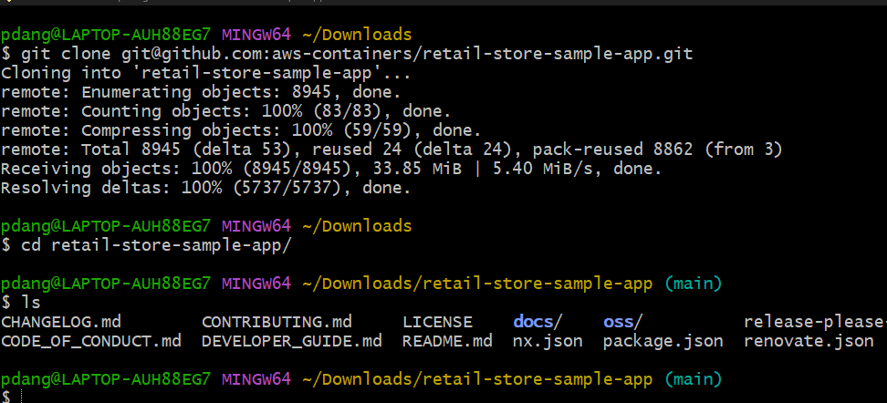


2. **Fork** the same repository on GitHub, then clone your fork

    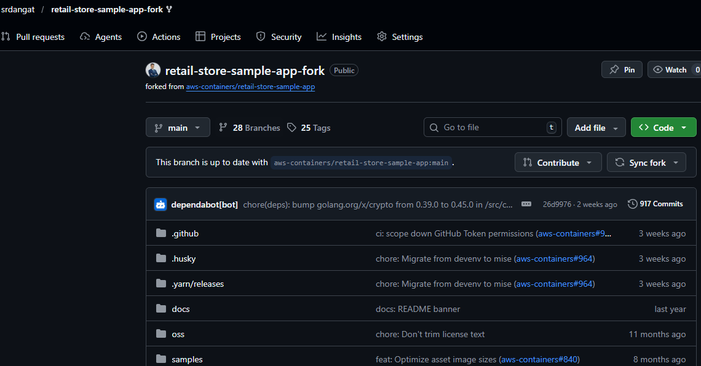
    
3. 1. What is the difference between clone and fork?

        - `clone` : Download the project from GitHub to my computer.
        - `fork` : Make my own copy of someone else’s project on GitHub.
   
   2. When would you clone vs fork?
   
        - `clone when`:
             - You are working on your own project.
             - You already have write access.
             - You just want the code locally.
             - Example: Working in your company repo where you’re a team member.
        - `fork when`
             - You don’t have write access.
             - You want to contribute to open source.
             - You want your own safe copy.
             - Example: Contributing to aws-containers repository retail-store-sample-app
             
   3. After forking, how do you keep your fork in sync with the original repo?
   
      - After forking and cloning my fork, I add the original repository as an upstream remote.Then I fetch changes from upstream, merge the upstream default branch into my current branch,and push the updates to my fork.
      - Example:
        ```bash
        git remote add upstream git@github.com:aws-containers/retail-store-sample-app.git
        git checkout main
        git fetch upstream
        git merge upstream/main
        git push origin main
        ```
---
