# Day 24 – Advanced Git: Merge, Rebase, Stash & Cherry Pick

## Challenge Tasks

### Task 1: Git Merge — Hands-On
1. Create a new branch `feature-login` from `main`, add a couple of commits to it

   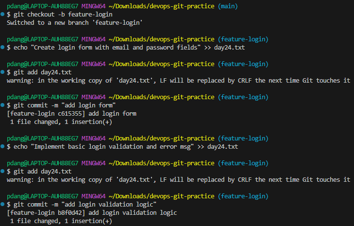

2. Switch back to `main` and merge `feature-login` into `main`

   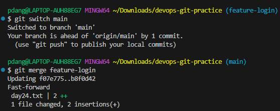

3. Observe the merge — did Git do a **fast-forward** merge or a **merge commit**?
- `fast-forward`

4. Now create another branch `feature-signup`, add commits to it — but also add a commit to `main` before merging

      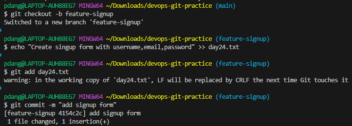

      

      
      
5. Merge `feature-signup` into `main` — what happens this time?
   - Merge conflicts happen because the same file is edited in two branches.

      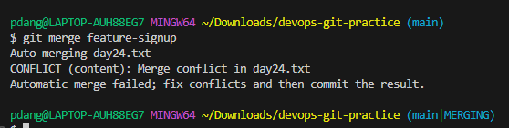

      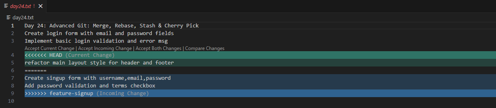

   - Resolved conflict

      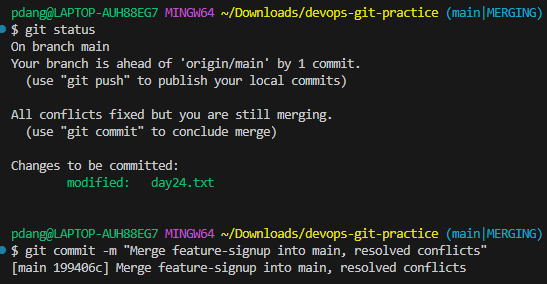

   - git log

      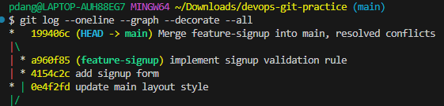

6. Answer in your notes:
   - What is a fast-forward merge?

      - A fast-forward merge occurs when the current branch (main) has no additional commits relative to the feature branch (feature-login).In this case,Git simply moves the pointer of the target branch forward to the latest commit of the feature branch. No new "merge commit" is created because the history remains a single,straight line.

         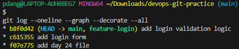

   - When does Git create a merge commit instead?

      - A merge commit is created when the histories of the two branches you are trying to join have diverged.

         

   - What is a merge conflict?

      - Merge conflicts happen because the same file is edited in two branches.Git can’t figure out which version of a file to keep during a merge.

---

### Task 2: Git Rebase — Hands-On
1. Create a branch `feature-dashboard` from `main`, add 2-3 commits

      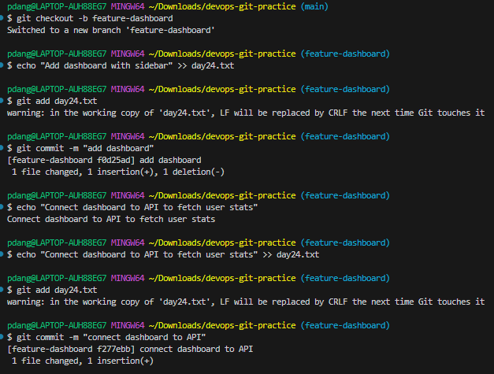

2. While on `main`, add a new commit (so `main` moves ahead)

      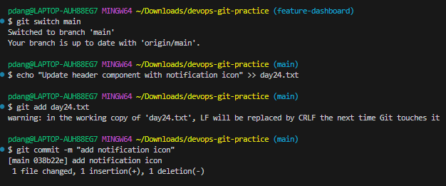

3. Switch to `feature-dashboard` and rebase it onto `main`

      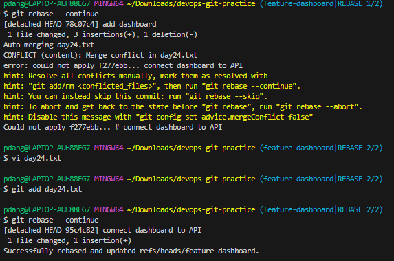

4. Observe your `git log --oneline --graph --all` — how does the history look compared to a merge?

      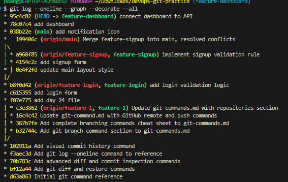

5. Answer in your notes:
   - What does rebase actually do to your commits?
      - rebase "rewrites history" by taking your feature-dashboard branch commits and replaying them one by one on top of the latest version of main.

   - How is the history different from a merge?
      - `merge`preserves history exactly as it happened.creates a merge commit.
      - `rebase`rewrites history.moves your commits on top of feature-dashboard branch,creates a linear,clean history.no merge commit.

   - Why should you **never rebase commits that have been pushed and shared** with others?
      - because rebase changes commit id's,if others pulled the old commits:their history won’t match yours anymore causes conflicts,duplicated commits.

   - When would you use rebase vs merge?

      - `rebase`: keeping history linear
      - `merge`: working on shared branches.you want full history preserved.

---

### Task 3: Squash Commit vs Merge Commit
1. Create a branch `feature-profile`, add 4-5 small commits (typo fix, formatting, etc.)

      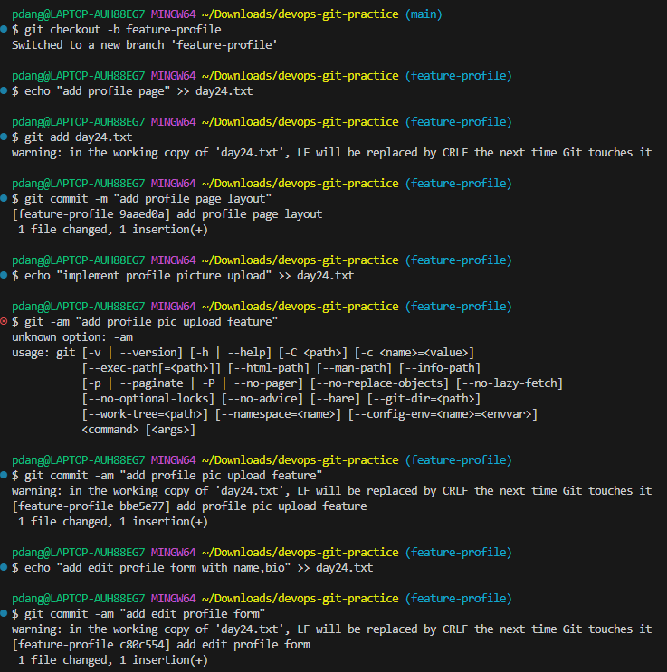

2. Merge it into `main` using `--squash` — what happens?

      

3. Check `git log` — how many commits were added to `main`?
   
   - Exactly one commit was added to the main branch.(12abdc7)

      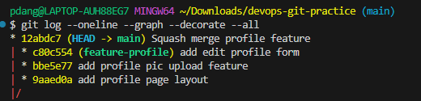

4. Now create another branch `feature-settings`, add a few commits

      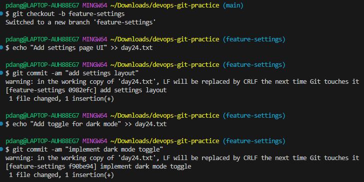

5. Merge it into `main` **without** `--squash` (regular merge) — compare the history

   - A regular merge preserves every individual commits 0982efc and f90be94 directly in the main history.

      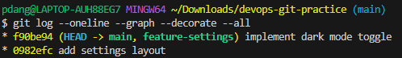

6. Answer in your notes:
   - What does squash merging do?
      - Combines all commits from a feature branch into one single commit on main.
      - Does not preserve individual commit history.

   - When would you use squash merge vs regular merge?
      - `squash merge`: Feature branch has many commits.You want clean main branch history.
      - `regular merge`: You want to preserve full commit history.

   - What is the trade-off of squashing?
      - The trade-off of squashing is that while it keeps the main branch history clean and linear,it removes the detailed commit history of the feature branch by combining everything into a single commit.

---

### Task 4: Git Stash — Hands-On
1. Start making changes to a file but **do not commit**
2. Now imagine you need to urgently switch to another branch — try switching. What happens?
- If there is no conflict,git allows the switch and your changes move with you.
- If there is a conflict,git blocks the switch to prevent overwriting your changes.

   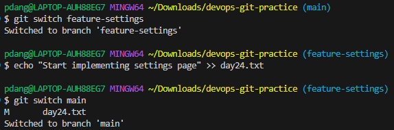

3. Use `git stash` to save your work-in-progress
4. Switch to another branch, do some work, switch back
5. Apply your stashed changes using `git stash pop`
6. Try stashing multiple times and list all stashes
7. Try applying a specific stash from the list

      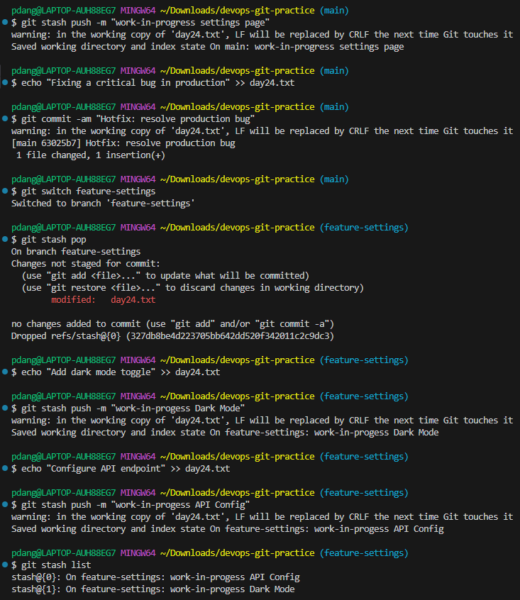

8. Answer in your notes:
   - What is the difference between `git stash pop` and `git stash apply`?

      `git stash pop`: brings your stashed changes back to your working directory.deletes that entry from your stash list immediately.

      `git stash apply`: brings the stashed changes back to your working directory.keeps the entry in your stash list.

   - When would you use stash in a real-world workflow?
      - If I’m working on a feature and need to urgently switch branches to fix a production bug,I would use git stash to temporarily save my unfinished changes before switching.

---

### Task 5: Cherry Picking
1. Create a branch `feature-hotfix`, make 3 commits with different changes

      

   
2. Switch to `main`

   - Before cherry-pick: `4b4eac0` Improve login error messages
      
      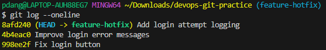

3. Cherry-pick **only the second commit** from `feature-hotfix` onto `main`
   - After resolving conflict: `bc0d4bd` (HEAD -> main) Improve login error messages
   - The commit ID changed because cherry-pick creates a new commit

      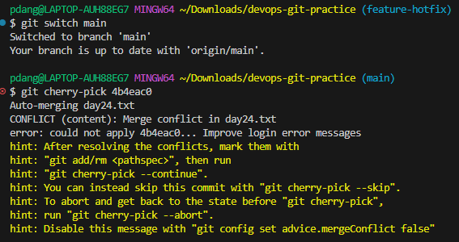

4. Verify with `git log` that only that one commit was applied

      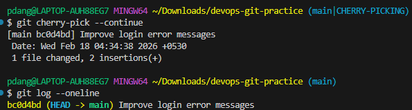

5. Answer in your notes:
   - What does cherry-pick do?
      - Applies a specific commit from one branch to another and creates a new commit with a new ID.

   
   - When would you use cherry-pick in a real project?
   
      - When I need only specific changes, like applying a hotfix from a feature branch to main,without merging the entire branch
   
   - What can go wrong with cherry-picking?
      - merge conflicts if same file was modified.
      - Commit history confusion because it creates new commit ids.

---