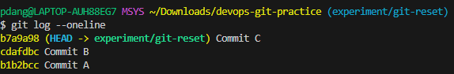
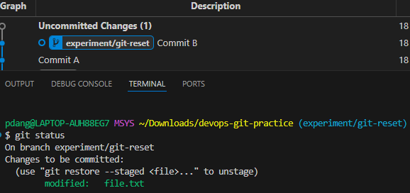
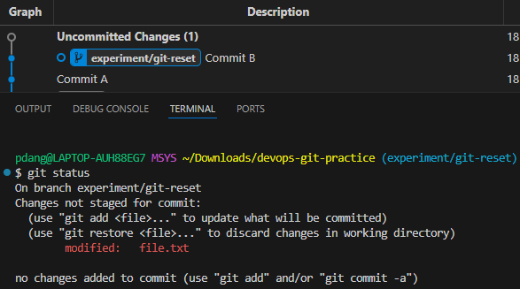
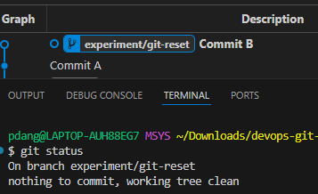
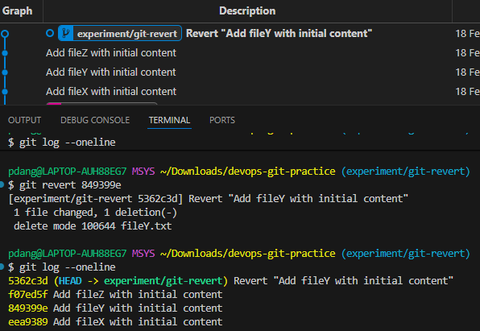

# Day 25 – Git Reset vs Revert & Branching Strategies

## Challenge Tasks

### Task 1: Git Reset — Hands-On
1. Make 3 commits in your practice repo (commit A, B, C)

    


2. Use `git reset --soft` to go back one commit — what happens to the changes?
    - You will see file.txt is "modified" and already in the staging area.Your changes from Commit C are still there and ready to be committed again.

    


3. Re-commit, then use `git reset --mixed` to go back one commit — what happens now?
    - You will see file.txt is "modified" but not staged.The changes from Commit C are still in the file, but Git isn't tracking them for a commit yet.

    


4. Re-commit, then use `git reset --hard` to go back one commit — what happens this time?
    - It will say "working tree clean.

    


5. Answer in your notes:
   - What is the difference between `--soft`, `--mixed`, and `--hard`?

        - `--soft` : move HEAD,keep changes staged.
        - `--mixed`: move HEAD,unstage changes.
        - `--hard` : move HEAD,discard all changes.

   - Which one is destructive and why?

        - `--hard` is destructive because it permanently discards all uncommitted changes in your staging area and working directory.

   - When would you use each one?

        - `--soft`   : when you want to undo a commit but keep changes staged,for example to edit the commit message.
        - ``--mixed``: when you want to undo a commit and unstage changes,so you can modify them before recommitting.
        - ``--reset``: when you want to completely remove commits and all changes.


   - Should you ever use `git reset` on commits that are already pushed?

        - No,once commits are pushed,others may have already pulled and worked on them,so resetting them can cause confusion and conflicts.


---

### Task 2: Git Revert — Hands-On
1. Make 3 commits (commit X, Y, Z)
2. Revert commit Y (the middle one) — what happens?
3. Check `git log` — is commit Y still in the history?

    - Commit Y is still in the history.A new commit was added.

    


4. Answer in your notes:
   - How is `git revert` different from `git reset`?

        - `git revert`: Creates a new commit that undoes changes from a previous commit.Keeps original commit in history
        - `git reset` : Can rewrite history.Moves the branch pointer to an earlier commit


   - Why is revert considered **safer** than reset for shared branches?

        - `git revert` does not rewrite history.

   - When would you use revert vs reset?
        - `git revert`: On branches that are already pushed/shared.To undo a commit without breaking history.
        - `git reset` : When you want to rewrite history or completely remove commits

---

### Task 3: Reset vs Revert — Summary


| | `git reset` | `git revert` |
|---|---|---|
| What it does | Can rewrite history.Moves the branch pointer to an earlier commit | Creates a new commit that undoes changes from a previous commit.Keeps original commit in history |
| Removes commit from history? | Yes | No |
| Safe for shared/pushed branches? | No | Yes |
| When to use | When you want to rewrite history or completely remove commits | On branches that are already pushed/shared.To undo a commit without breaking history |

---

---

### Task 4: Branching Strategies

1. **GitFlow**
    
    **How it works:**

    - `main`      : Contains production-ready code.Every commit here is a stable release.
        
    - `develop`   : The integration branch where new features are merged before they’re ready to go live.
    
    - `feature`   : For building out new functionality.Created from develop and merged back when complete.
        
    - `release`   : Used to prep a new version for production.Created from develop and merged into both main and develop.

    - `hotfix`   : For urgent fixes on production.Created from main,then merged back into both main and develop.

    **Text Diagram:**
    ```text
    [main] (Production-ready)
    |
    o <----------------------------------------- (Start)
    | \
    |  \ [develop] (Integration)
    |   |
    |   o <------------------------------------- (Develop Start)
    |   | \
    |   |  \ [feature/login] (New functionality)
    |   |   |
    |   |   o (Feature Commit)
    |   |   |
    |   |   o (Feature Complete)
    |   |  /
    |   o / (Merge feature to develop)
    |   |
    |   | \
    |   |  \ [release/1.0] (Prep for production)
    |   |   |
    |   |   o (Release Prep/Bug Fix)
    |   |   |
    |   |   o (Release Ready)
    |   |  / \
    |   o /   o (Merge release to develop)
    |  /
    o / (Merge release to main & tag v1.0)
    |
    | \
    |  \ [hotfix/1.0.1] (Urgent fix)
    |   |
    |   o (Apply Fix)
    |  / \
    o /   o (Merge hotfix to develop)
    |
    V
    ```

    **When/where it's used:**

    - Team follows scheduled release cycles

    - Need to maintain multiple versions

    **Pros:** 
    - Clear separation of concerns across features,releases,and hotfixes.

    **Cons:** 
    - Can result in long-lived branches,increasing the risk of merge conflicts.


2. **GitHub Flow**

    **How it works:**

    - Create a `feature branch` from `main`
    - Push commits to the `feature branch`
    - Open a pull request for code review and automated tests.
    - Once approved, merge back to `main`.
    - Deploy immediately.
    - Everything in main should always be production-ready.

    **Text Diagram:**
    ```text  
   
      [main] (Always Production-Ready)
        |
        o (Start)
        |
        |\_ _ _ _ _ _ _ _ _ _ _ _ _ _ _ 
        |                               \
        |                                \ [feature/login]
        |                                 |
        |                                 o (Commit 1)
        |                                 |
        |                                 o (Commit 2)
        |                                 |
        |                                 o (Pull Request & Review)
        |<_ _ _ _ _ _ _ _ _ _ _ _ _ _ _ _/
        |                               
        o (Merge & Auto-Deploy)
        |
        v
    ```

    **When/where it's used:**
    - ship frequent,small releases

     **Pros:**
    - Fast merge & deploy
    
     **Cons:**
     - In large teams,it can result in frequent merge conflicts

3. **Trunk-Based Development**

    **How it works:**

    - There’s one `main` branch, often called main or trunk. All development happens here
    - Developers commit directly to `main`, often multiple times per day
    - Changes are small,incremental

     **Text Diagram:**
     ```text
      [main] (The Trunk)
        |
        o (Start)
        |
        |\_ _ _ _ _ _ _ 
        |             \
        |              o (Dev A: Small Change)
        |<_ _ _ _ _ _ /
        |             /
        o (Merge & Test)
        |
        |\_ _ _ _ _ _ _ 
        |             \
        |              o (Dev B: Small Change)
        |<_ _ _ _ _ _ /
        |             /
        o (Merge & Test)
        |
        v
    ```

    **When/where it's used:**
    - building SaaS products or anything that updates frequently


    **Pros:**
    - Delivers the fastest feedback from dev to prod

    **Cons:**
    - Can be risky without tests

4. Answer:

   - Which strategy would you use for a startup shipping fast?
        - Trunk-Based Development
        
   - Which strategy would you use for a large team with scheduled releases?

        - GitFlow

   - Which one does your favorite open-source project use?

        - https://github.com/aws-containers/retail-store-sample-app.git (GitHub Flow)

---

### Task 5: Git Commands Reference Update

https://github.com/srdangat/devops-git-practice/blob/main/git-command.md
