# Day 26 – GitHub CLI: Manage GitHub from Your Terminal

### Task 1: Install and Authenticate
1. Install the GitHub CLI on your machine
2. Authenticate with your GitHub account
3. Verify you're logged in and check which account is active

    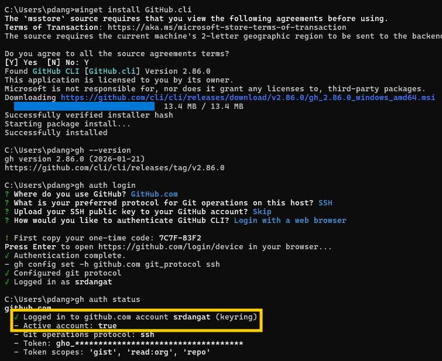

4. Answer in your notes: What authentication methods does `gh` support?
    - Browser-based OAuth
    - Personal Access Token (PAT)
    - SSH Key-based
---

### Task 2: Working with Repositories
1. Create a **new GitHub repo** directly from the terminal — make it public with a README

    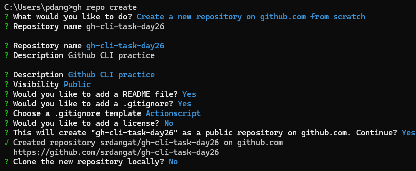

2. Clone a repo using `gh` instead of `git clone`

    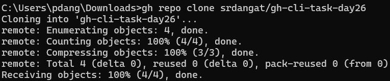

3. View details of one of your repos from the terminal

    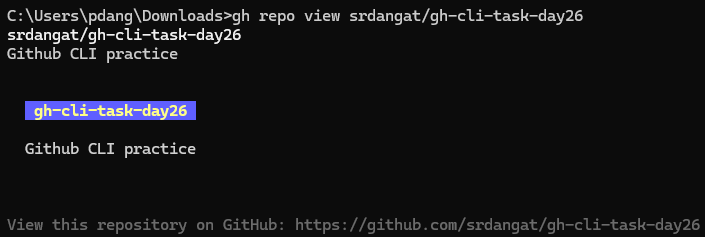

4. List all your repositories

    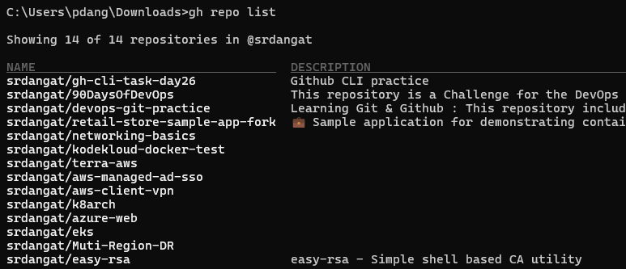

5. Open a repo in your browser directly from the terminal

    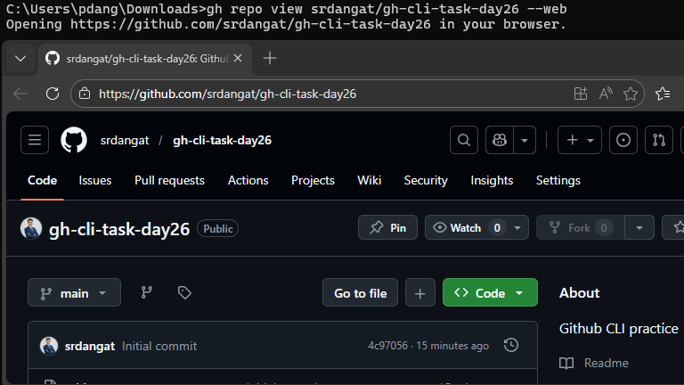

6. Delete the test repo you created (be careful!)

    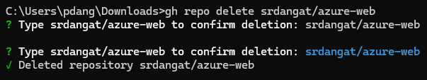

---

### Task 3: Issues
1. Create an issue on one of your repos from the terminal — give it a title, body, and a label

    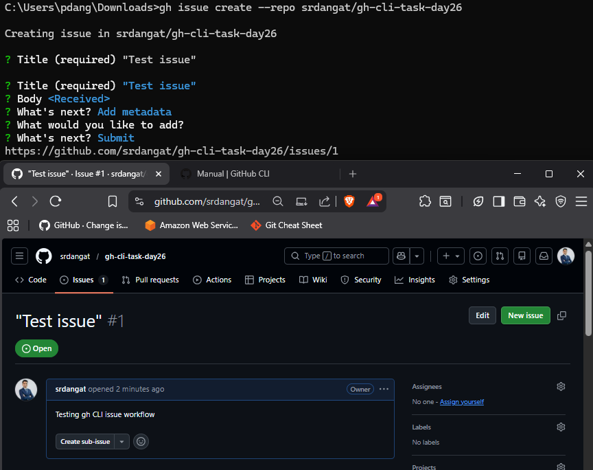

2. List all open issues on that repo

    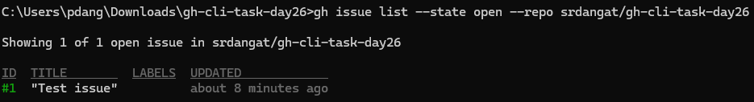

3. View a specific issue by its number

    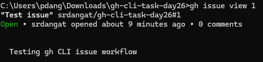

4. Close an issue from the terminal

    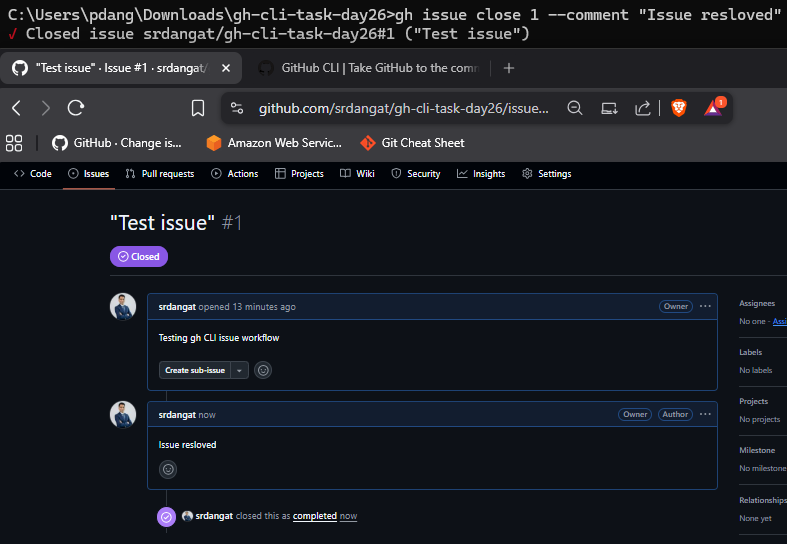

5. Answer in your notes: How could you use `gh issue` in a script or automation?
    - By combining gh issue commands in a script,you can automatically:
        - Check open issues
        - Add comments
        - Close issues

    - Example:
        ```bash
        gh issue list --repo srdangat/gh-cli-task-day26
        gh issue comment 1 --repo srdangat/gh-cli-task-day26 --body "Checked automatically."
        gh issue close 1 --repo srdangat/gh-cli-task-day26
        ```

---

### Task 4: Pull Requests
1. Create a branch, make a change, push it, and create a **pull request** entirely from the terminal

    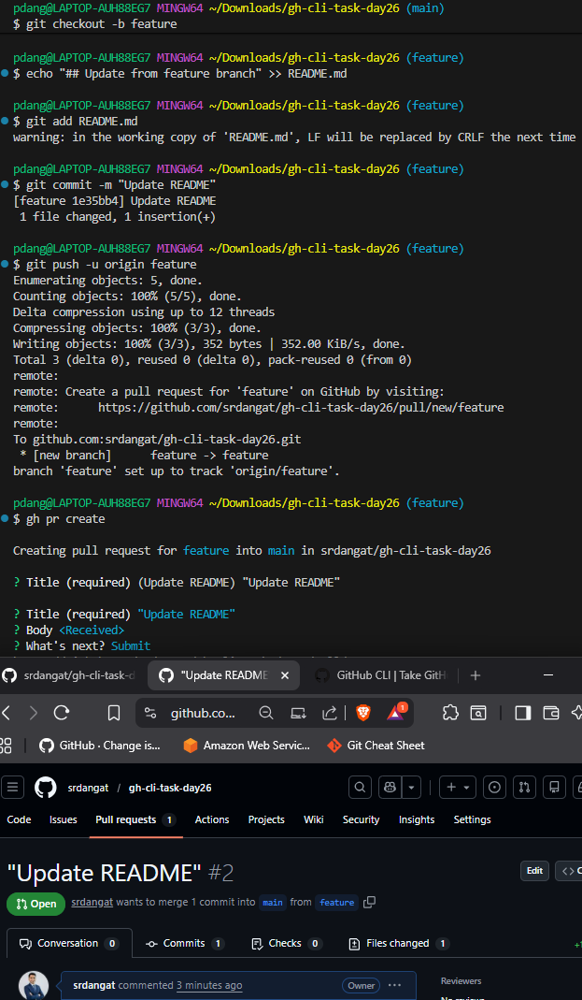

2. List all open PRs on a repo
3. View the details of your PR — check its status, reviewers, and checks

    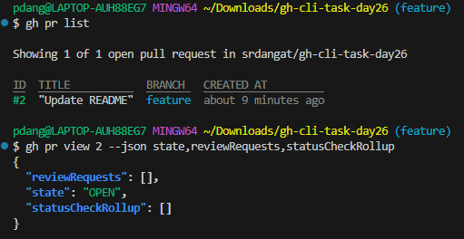


4. Merge your PR from the terminal

    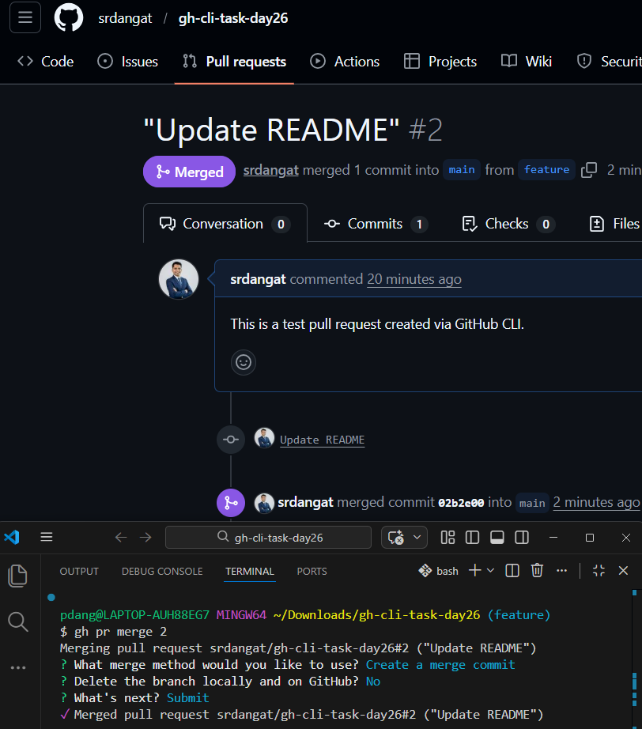

5. Answer in your notes:

   - What merge methods does `gh pr merge` support?

    - Merge Commit
    - Squash and Merge
    - Rebase and Merge

   - How would you review someone else's PR using `gh`?
    - `gh pr review <PR-number>`

---

### Task 5: GitHub Actions & Workflows (Preview)
1. List the workflow runs on any public repo that uses GitHub Actions
2. View the status of a specific workflow run

    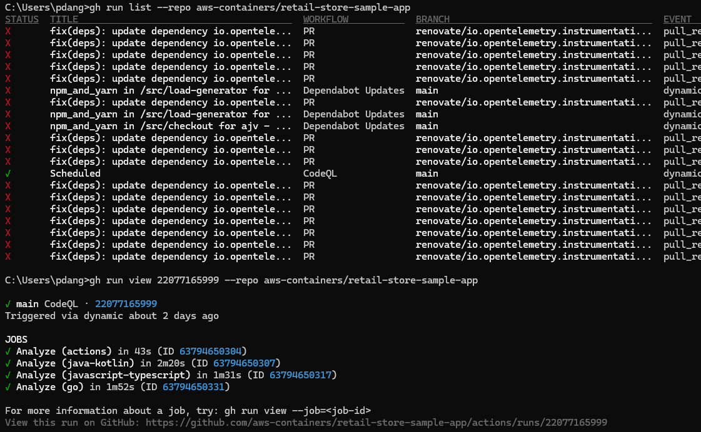

3. Answer in your notes: How could `gh run` and `gh workflow` be useful in a CI/CD pipeline?

    - They enable you to control and automate GitHub Actions programmatically,allowing you to start, track and manage workflows directly from scripts without needing manual interaction

---