# Day 29 – Introduction to Docker

## Task 1

### What is Docker?

- It’s an instance of an image that is ready to execute code with all its necessary libraries,configurations and files.

### Why we need?

- You can build locally,deploy to the cloud and run anywhere on any server.
- Shares the host kernel,making them much more efficient in therms of system resources than vitual machine.
- Makes collaboration easier ,same environment for everyone
- No version mismatch issues.


### Containers vs Virtual Machines

| Feature | Virtual Machines (VMs) | Containers |
|----------|------------------------|------------|
| **Virtualization Level** | Hardware-level virtualization | OS-level virtualization |
| **Architecture** | Includes full guest OS + hypervisor | Shares host OS kernel |
| **Size** | Large (GBs) | Small (MBs) |
| **Startup Time** | Slow (minutes) | Fast (seconds) |
| **Performance** | Slower due to OS overhead | Faster, lightweight |
| **Isolation** | Strong (separate OS per VM) | Process-level isolation |
| **Resource Usage** | High CPU, RAM, Storage usage | Efficient resource usage |
| **Portability** | Less portable | Highly portable |
| **Management** | Complex (manage full OS) | Simple (manage app + dependencies) |
| **Best For** | Legacy apps, multiple OS environments | Microservices, CI/CD, cloud-native apps |


### Docker architecture

---

### Docker Client

### What it is
The Docker client is the command-line interface (CLI) used to interact with Docker. It acts as the command center.

### How it works
You type commands in the Docker client, and it sends those requests to the Docker daemon, which performs the actual work.

### Example Commands
- `docker build`
- `docker run`
- `docker pull`
- `docker push`

---

### Docker Daemon

### What it is
The Docker daemon (`dockerd`) is the background service that manages Docker objects such as images, containers, networks, and volumes.

### How it works
The daemon:
- Listens for Docker API requests from the Docker client
- Builds images
- Runs and manages containers
- Handles networking and storage


---

### Docker Hub

### What it is
Docker Hub is a cloud-based public registry for Docker images.

### How it works
It works like an app store for container images. 

You can:
- **Pull** images created by others
- **Push** your own images

### Usage
When you need an image to create a container, you can pull it from Docker Hub.

---

### Docker Registry

### What it is
A Docker registry is a system that stores and distributes Docker images. Docker Hub is the most popular public registry,but you can also create private registries.

### How it works
Registries:
- Store Docker images
- Allow users to pull images
- Allow users to push images

Private registries are commonly used by companies to securely store internal application images.

---

### Task 2: Install Docker
1. Install Docker on your machine (https://docs.docker.com/engine/install/)

    ```bash
    # Add Docker's official GPG key:
    sudo apt update
    sudo apt install ca-certificates curl
    sudo install -m 0755 -d /etc/apt/keyrings
    sudo curl -fsSL https://download.docker.com/linux/ubuntu/gpg -o /etc/apt/keyrings/docker.asc
    sudo chmod a+r /etc/apt/keyrings/docker.asc

    # Add the repository to Apt sources:
    sudo tee /etc/apt/sources.list.d/docker.sources <<EOF
    Types: deb
    URIs: https://download.docker.com/linux/ubuntu
    Suites: $(. /etc/os-release && echo "${UBUNTU_CODENAME:-$VERSION_CODENAME}")
    Components: stable
    Signed-By: /etc/apt/keyrings/docker.asc
    EOF

    sudo apt update
    sudo systemctl status docker
    sudo systemctl start docker

    sudo usermod -aG docker $USER
    newgrp docker
    ```

2. Verify the installation

    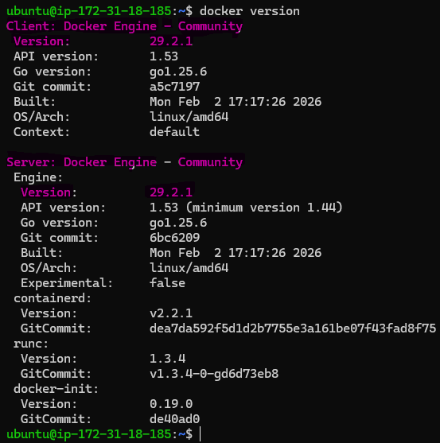

3. Run the `hello-world` container: **docker run hello-world**

    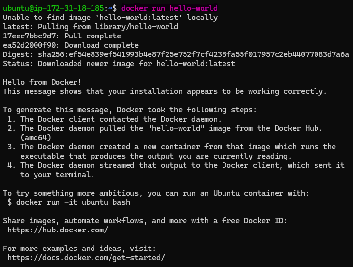

4. **Output explain** :
- Docker didn’t find the hello-world image on your machine.
- It downloaded (pulled) it from Docker Hub.
- Docker created a container from that image.
- The container ran a small program that printed “Hello from Docker!”
- The container exited.

---

### Task 3: Run Real Containers
1. Run an **Nginx** container and access it in your browser: **docker run -d -p 80:80 nginx**  **<host_port>:<container_port>**

    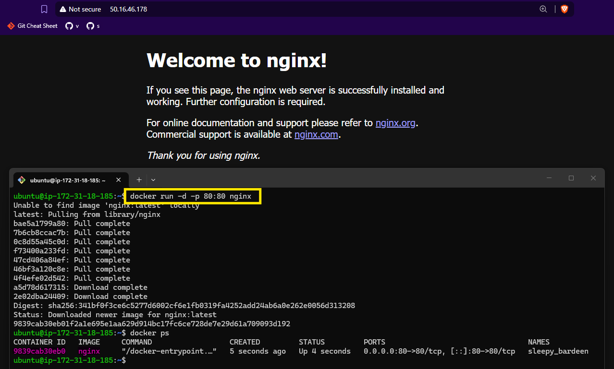

2. Run an **Ubuntu** container in interactive mode: **docker run -it ubuntu**

    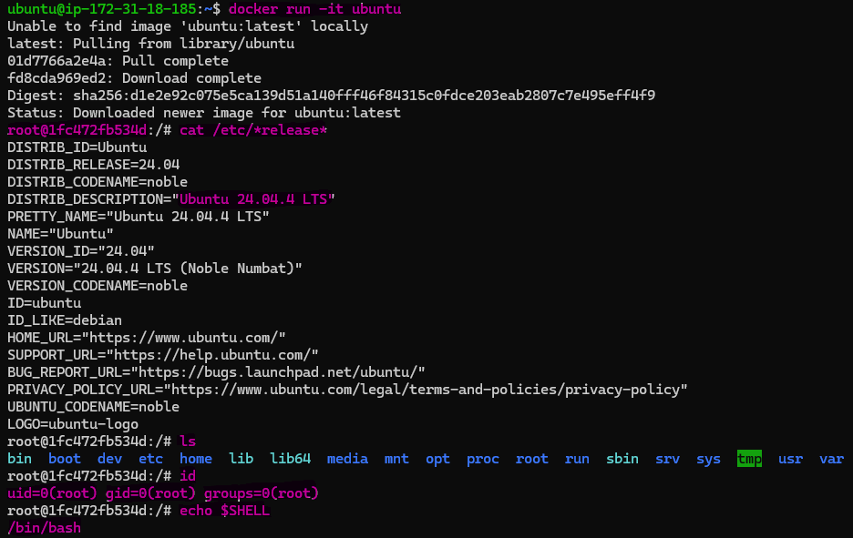


3. List all running containers: **docker ps**

    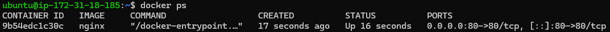

4. List all containers (including stopped ones): **docker ps -a**

    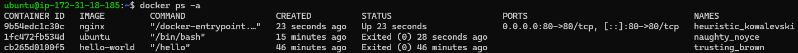


5. Stop and remove a container: **docker stop <container-id>** && **docker rm <container-id>**

    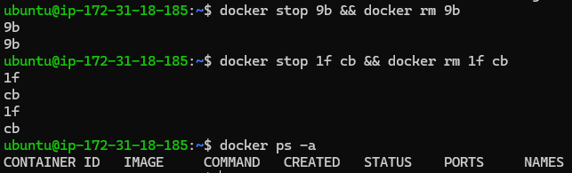

---

### Task 4: Explore
1. Run a container in **detached mode** : **detach mode** **run containers in background mode**

    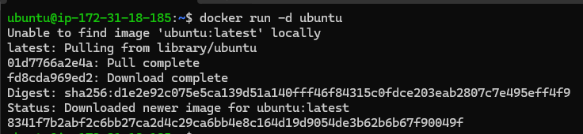

2. Give a container a custom **name** : **docker run -d --name web httpd**

    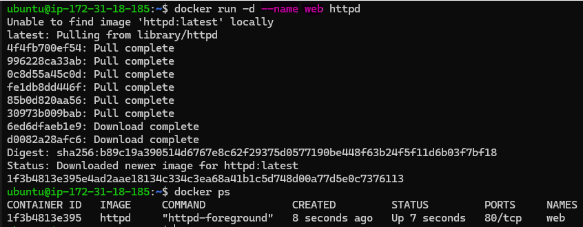

3. Map a **port** from the container to your host: **docker run -d --name web2 -p 80:80 nginx**  **<host_port>:<container_port>**

    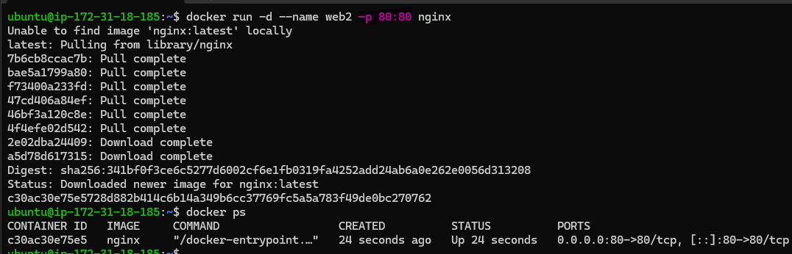

4. Check **logs** of a running container: **docker logs <container-id>**

    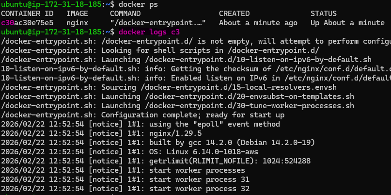


5. Run a command **inside** a running container : **docker exec -it <container-id>**

    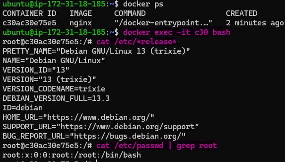


---

## Why This Matters for DevOps

- Docker is the foundation of modern deployment. 
- Every CI/CD pipeline, Kubernetes cluster,and microservice - architecture starts with containers. 
- Today you took the first step