# Day 30 – Docker Images & Container Lifecycle

## Challenge Tasks

### Task 1: Docker Images
1. Pull the `nginx`, `ubuntu`, and `alpine` images from Docker Hub

    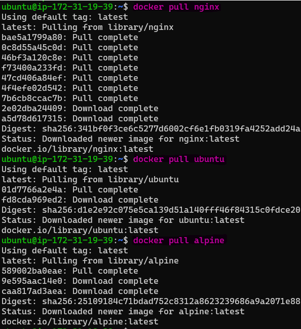

2. List all images on your machine

    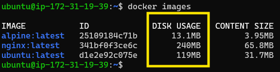

    | Image         | Disk Usage | Content Size |
    | ------------- | ---------- | ------------ |
    | alpine:latest | 13.1MB     | 3.95MB       |
    | nginx:latest  | 240MB      | 65.8MB       |
    | ubuntu:latest | 119MB      | 31.7MB       |

    **Local Size(Disk usage) is actual image size**

    **Transfer Size(Content Size) is amount of data used when pulling the inage over a network**

3. Compare `ubuntu` vs `alpine`

- `Ubuntu` is a full-featured Linux distribution, while `Alpine` is a minimal distribution optimized for containers. 
- `Ubuntu` is larger because it includes GNU tools and glibc, whereas `Alpine` uses BusyBox and musl, making it much smaller.

4. Inspect an image — what information can you see?

    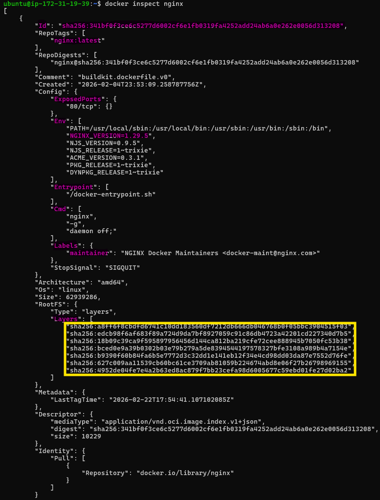

    - Image ID: sha256:341bf0f3ce6c...
    - Image: nginx:latest
    - Exposed Port: 80/tcp (HTTP)
    - Repository: docker.io/library/nginx
    - Environment variable
    - NGINX Version: 1.29.5
    - ENTRYPOINT
    - CMD
    - Lables,maintainer
    - Filesystem | Uses layered filesystem | 7 layers

5. Remove an image you no longer need

    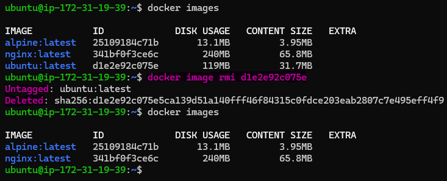

---

### Task 2: Image Layers
1. Run `docker image history nginx` — what do you see?

    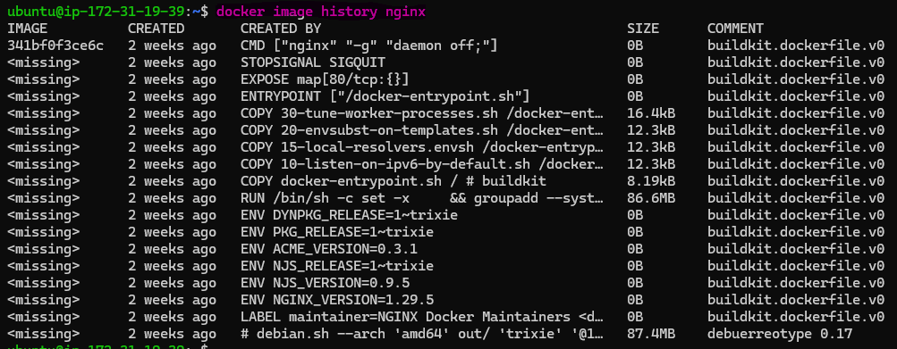

- A list of instructions used to build the nginx image (e.g., CMD, EXPOSE, ENTRYPOINT, COPY, RUN, ENV, LABEL) Each instruction corresponds to a layer

2. Each line is a **layer**. Note how some layers show sizes and some show 0B

- Layers with a size (MB or kB) were created by instructions that modify the filesystem,such as RUN, COPY, or ADD.
- Layers showing 0B were created by instructions that only change metadata, such as ENV, CMD, EXPOSE, LABEL, or ENTRYPOINT.These do not change the filesystem.

3. What are layers and why does Docker use them?

- Docker layers are read-only filesystem snapshots created by each instruction in a Dockerfile.
- Docker uses layers because:
    - They allow build caching (faster builds)
    - They allow images to share
 common layers (saves storage).
    - They make image downloads faster (only new layers are pulled)

---

### Task 3: Container Lifecycle
Practice the full lifecycle on one container:
1. **Create** a container (without starting it)
2. **Start** the container
3. **Pause** it and check status
4. **Unpause** it
5. **Stop** it
6. **Restart** it
7. **Kill** it
8. **Remove** it
Check `docker ps -a` after each step — observe the state changes.

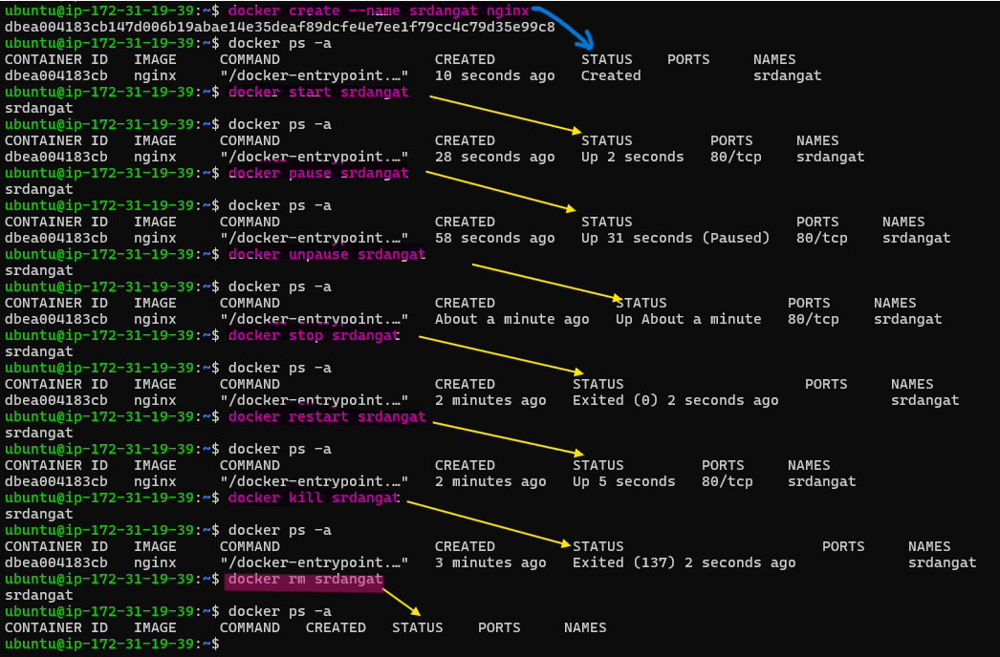

---

### Task 4: Working with Running Containers
1. Run an Nginx container in detached mode
2. View its **logs**
3. View **real-time logs** (follow mode)

    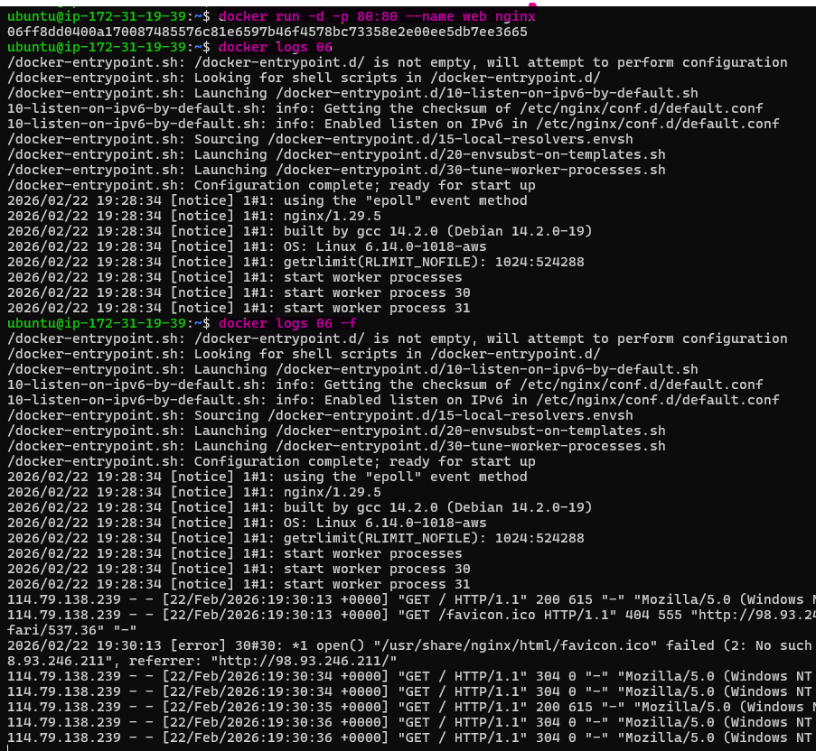

4. **Exec** into the container and look around the filesystem

    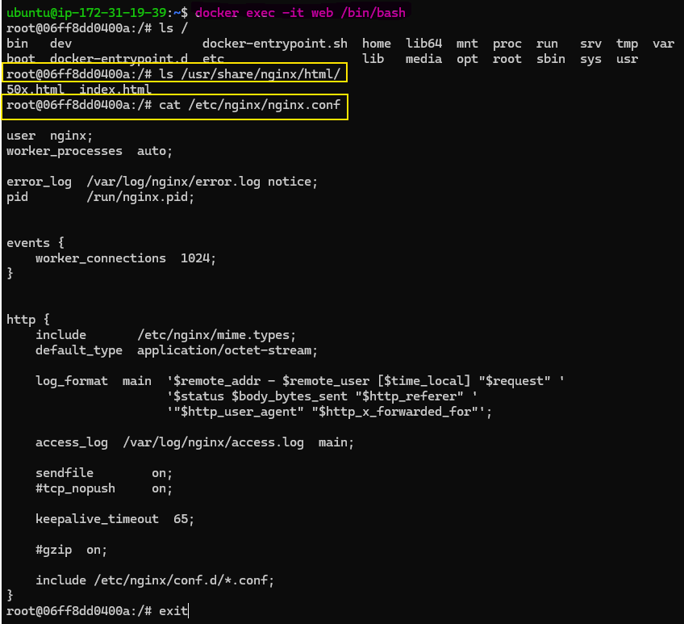

5. Run a single command inside the container without entering it

    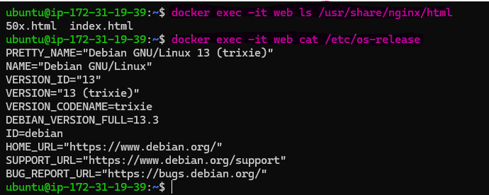

6. **Inspect** the container — find its IP address, port mappings, and mounts

    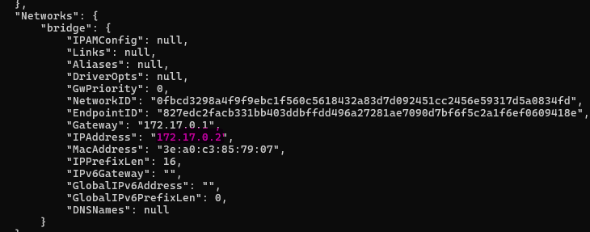

    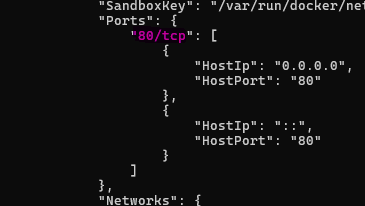

    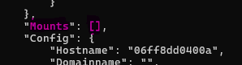
---

### Task 5: Cleanup

1. Stop all running containers in one command
2. Remove all stopped containers in one command
3. Remove unused images

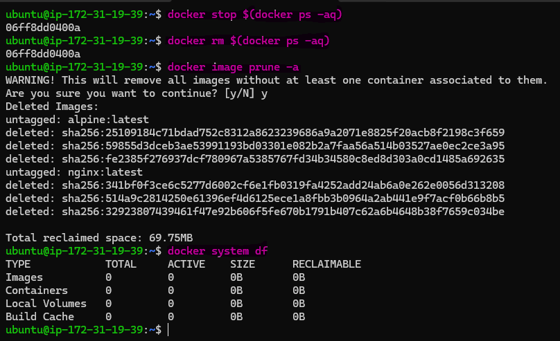

4. Check how much disk space Docker is using

- 0B of disk space because all images and containers were removed successfully.

---