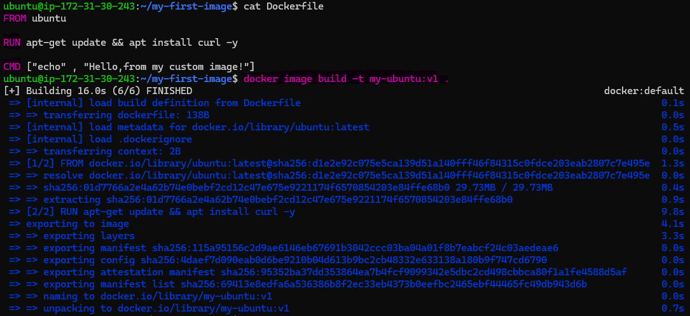
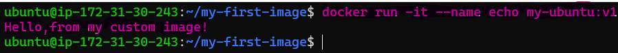
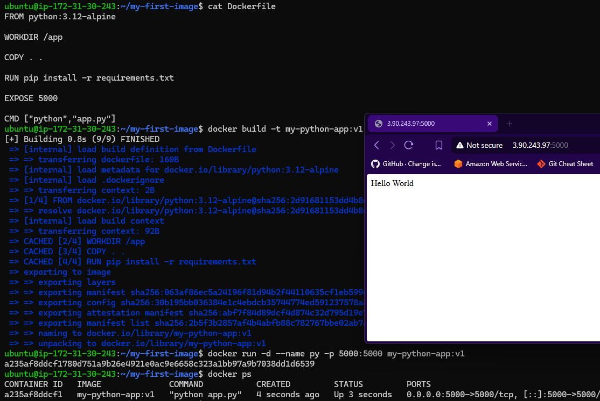
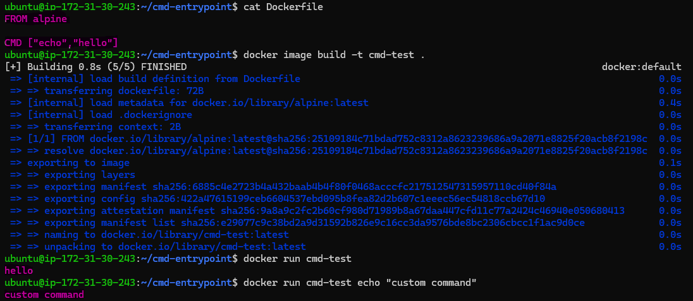
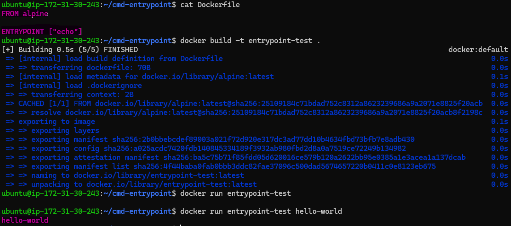
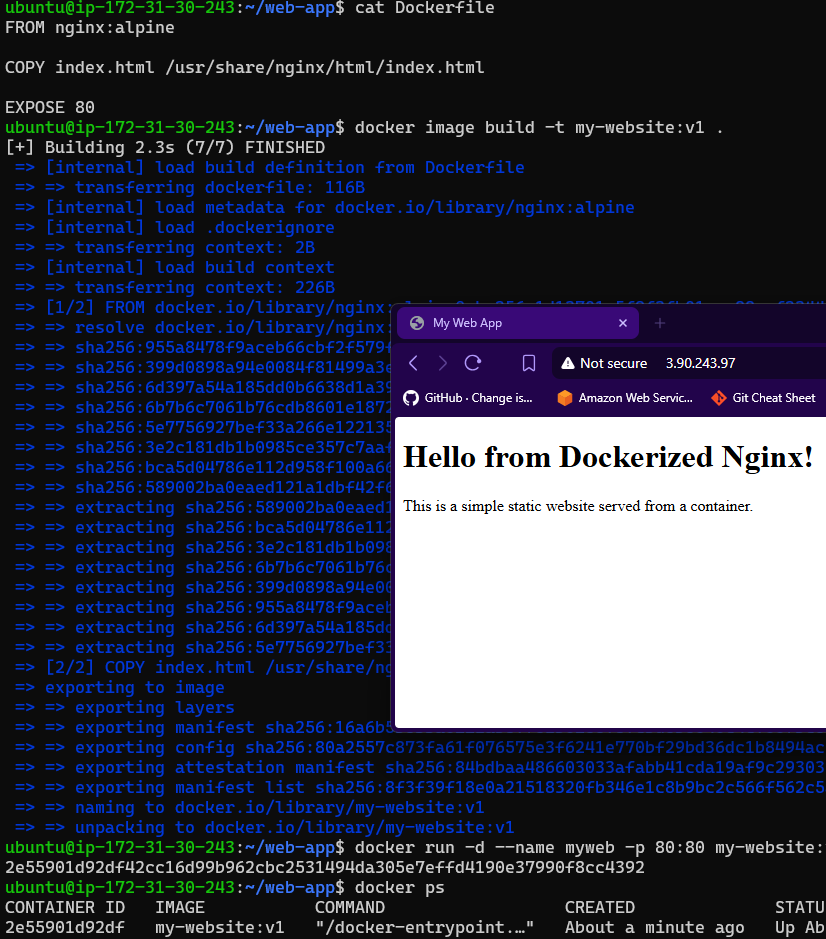
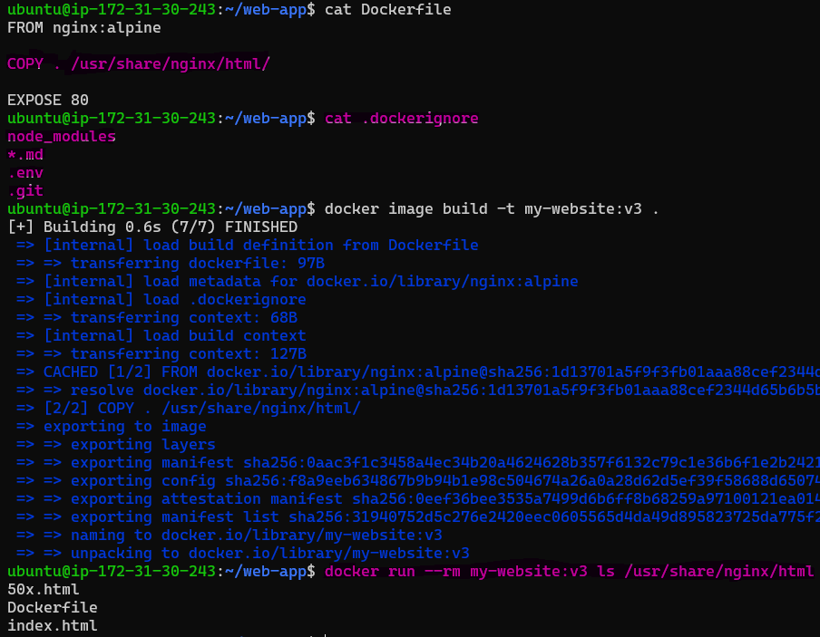
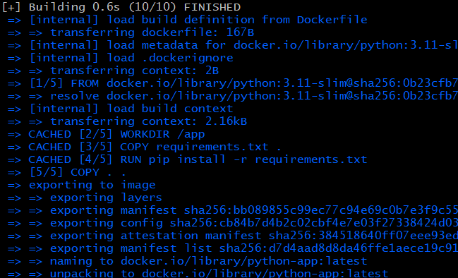

# Day 31 – Dockerfile: Build Your Own Images

## Challenge Tasks

### Task 1: Your First Dockerfile
1. Create a folder called `my-first-image`
2. Inside it, create a `Dockerfile` that:
   - Uses `ubuntu` as the base image
   - Installs `curl`
   - Sets a default command to print `"Hello from my custom image!"`
3. Build the image and tag it `my-ubuntu:v1`

    

4. Run a container from your image

    

**Verify:** The message prints on `docker run`

    

---

### Task 2: Dockerfile Instructions

- `FROM` `python:3.12-alpine`
Uses lightweight Python image based on Alpine Linux.

- `WORKDIR` `/app`
Sets /app as working directory inside container.

- `COPY . .`
Copies everything from your my-first-image folder into /app inside container.

- `RUN` `pip install -r requirements.txt`
Installs all Python dependencies.

- `EXPOSE 5000`
Documents that container uses port 5000.

- `CMD ["python","app.py"]`
Runs Python app when container starts.




---

### Task 3: CMD vs ENTRYPOINT
1. Create an image with `CMD ["echo", "hello"]` — run it, then run it with a custom command. What happens?

    

* **Run without arguments:**
  The container runs the default command `echo hello` and outputs:

  ```
  hello
  ```

* **Run with a custom command:**
  When you run the container with a custom command (e.g., `echo "custom command"`), the custom command **completely overrides** the `CMD`, so the output is:

  ```
  custom command
  ```


2. Create an image with `ENTRYPOINT ["echo"]` — run it, then run it with additional arguments. What happens?

    

* **Run without arguments:**
  The container runs `echo` with no arguments,resulting in a blank line (no output).

* **Run with additional arguments:**
  When you pass arguments (e.g., `hello-world`), they are **appended** to the `ENTRYPOINT`, so it runs `echo hello-world` and outputs:

  ```
  hello-world
  ```

3. When would you use CMD vs ENTRYPOINT?

- Use `CMD` when you want to provide a default command that can be changed easily when you run the container.

- Use `ENTRYPOINT` when you want to set a fixed command that always runs.

---

### Task 4: Build a Simple Web App Image
1. Create a small static HTML file (`index.html`) with any content
2. Write a Dockerfile that:
   - Uses `nginx:alpine` as base
   - Copies your `index.html` to the Nginx web directory
3. Build and tag it `my-website:v1`
4. Run it with port mapping and access it in your browser

    

---

### Task 5: .dockerignore
1. Create a `.dockerignore` file in one of your project folders
2. Add entries for: `node_modules`, `.git`, `*.md`, `.env`
3. Build the image — verify that ignored files are not included

    


There should be no test.md, .env, .git, or node_modules listed
---

### Task 6: Build Optimization
1. Build an image, then change one line and rebuild — notice how Docker uses **cache**

```bash
FROM python:3.11-slim
WORKDIR /app
COPY . .
RUN pip install -r requirements.txt
CMD ["python","app.py"]
```
Observation: The image is built successfully and all layers are created.

Change one line and rebuild: change in app.py

```bash
FROM python:3.11-slim
WORKDIR /app
COPY . .
RUN pip install -r requirements.txt
CMD ["python","app.py"]
```

Observation:
Even though only the application code changed
Docker re-ran pip install -r requirements.txt
Any change in source code invalidated the cache for all following layers.


2. Reorder your Dockerfile so that frequently changing lines come **last**

```bash
FROM python:3.11-slim
WORKDIR /app
COPY requirements.txt .
RUN pip install -r requirements.txt
COPY . .
CMD ["python","app.py"]
```



Observation:
Docker reused cached layers for: Base image,Working directory,Dependency installation

3. Why does layer order matter for build speed?

- Docker builds images in layers and caches each layer.
- If a layer changes,Docker rebuilds that layer and all layers after it.
- By placing:
    - Rarely changing files (dependencies) first
    - Frequently changing files (source code) last
- Docker can reuse cached layers,resulting in faster rebuilds.

---
