# Day 32 – Docker Volumes & Networking

## Challenge Tasks

### Task 1: The Problem
1. Run a Postgres or MySQL container
    
    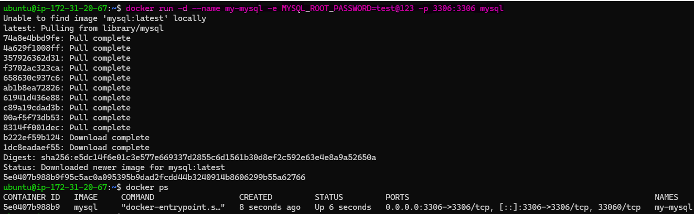

2. Create some data inside it (a table, a few rows — anything)

    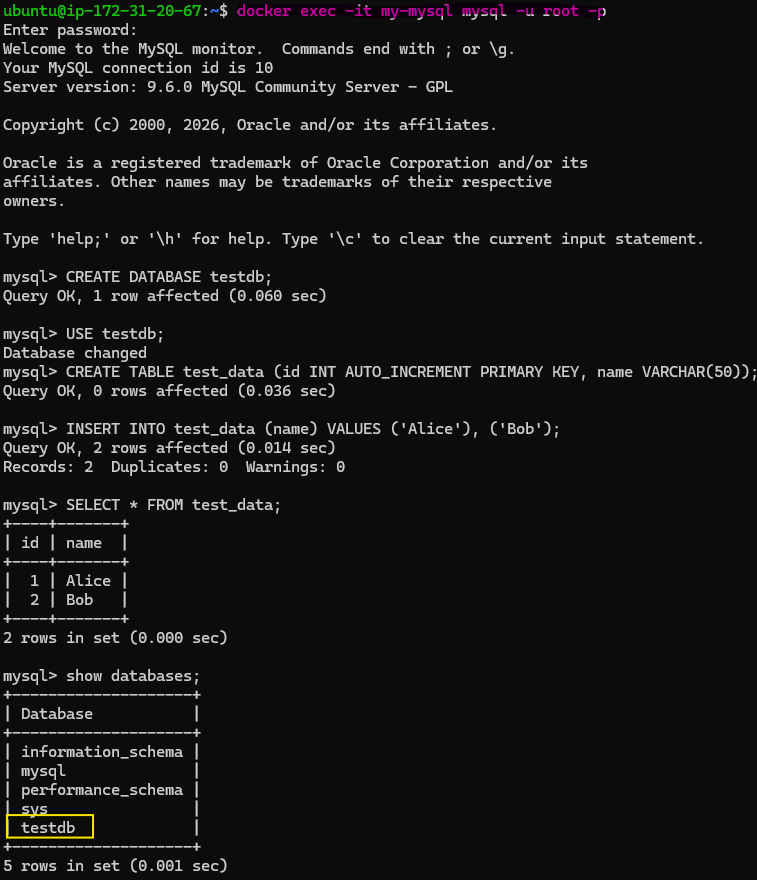

3. Stop and remove the container

    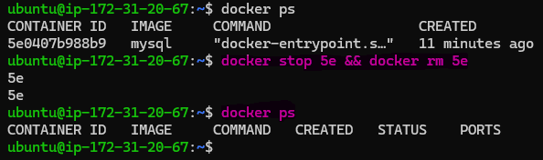

4. Run a new one — is your data still there?

    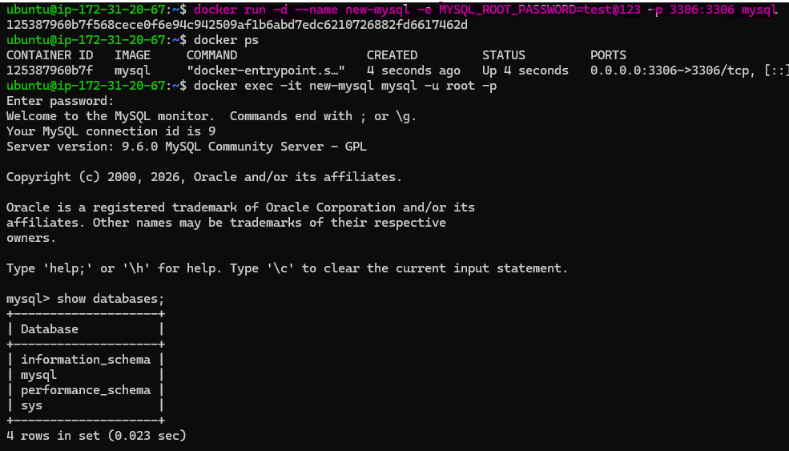

    - No, Data is lost when a container is removed because containers are ephemeral and do not persist data by default.

---

### Task 2: Named Volumes
1. Create a named volume

    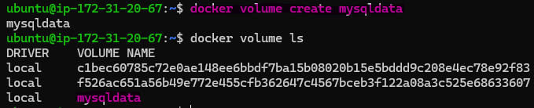

2. Run the same database container, but this time **attach the volume** to it

    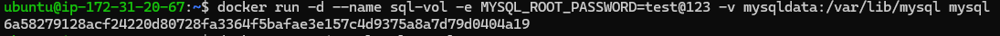

3. Add some data, stop and remove the container

    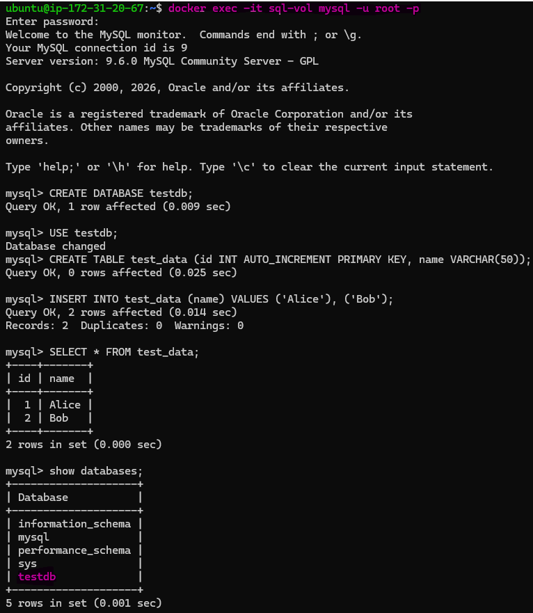

    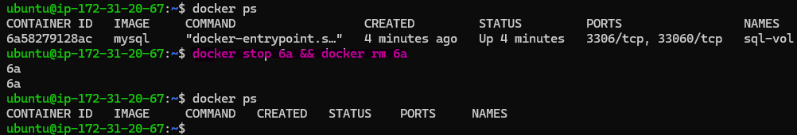

4. Run a brand new container with the **same volume**

    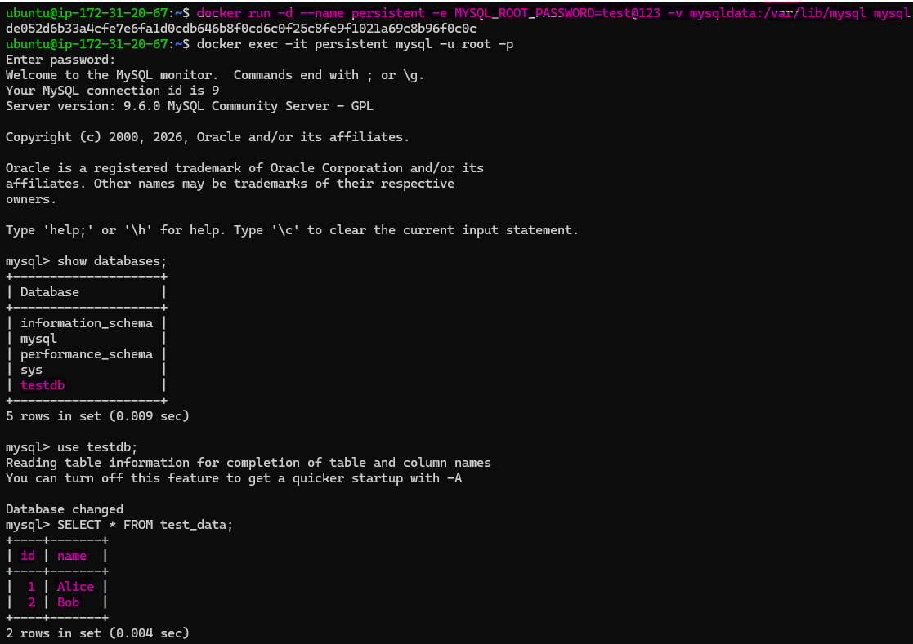
5. Is the data still there?
    - Yes,all previous data ,tables and rows are still there.

    Verify: `docker volume ls`, `docker volume inspect`

    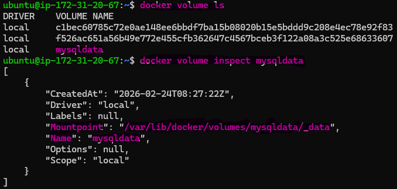

---

### Task 3: Bind Mounts
1. Create a folder on your host machine with an `index.html` file

    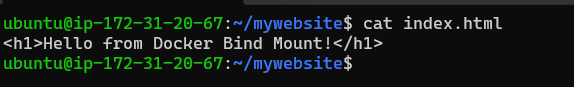

2. Run an Nginx container and **bind mount** your folder to the Nginx web directory
3. Access the page in your browser

    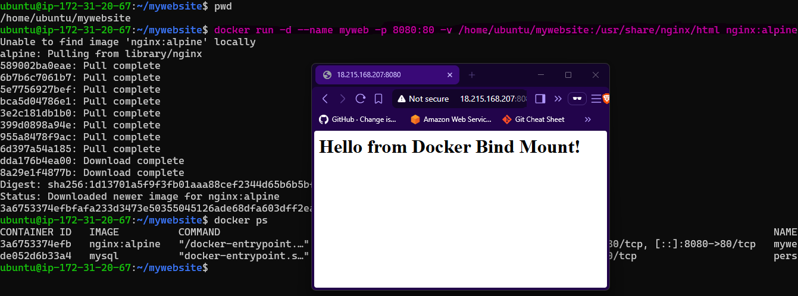

4. Edit the `index.html` on your host — refresh the browser

    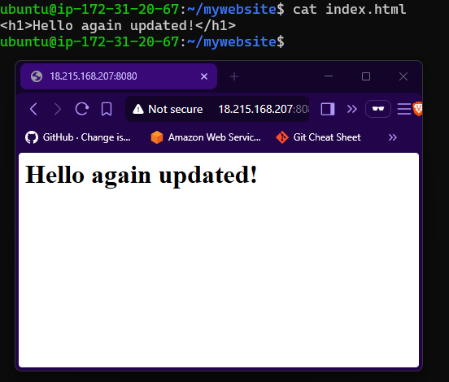

**Volumes vs Bind Mounts**
    
**Volumes:**
- Managed by Docker.
- Stored in a part of the host filesystem which is managed by Docker.
- Preferred method for data persistence.

**Bind Mounts:**
- Maps a file or directory on the host to a file or directory in the container.
- More complex but provides flexibility to interact with the host system.

---

### Task 4: Docker Networking Basics
1. List all Docker networks on your machine

    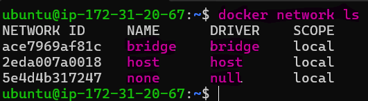

2. Inspect the default `bridge` network

    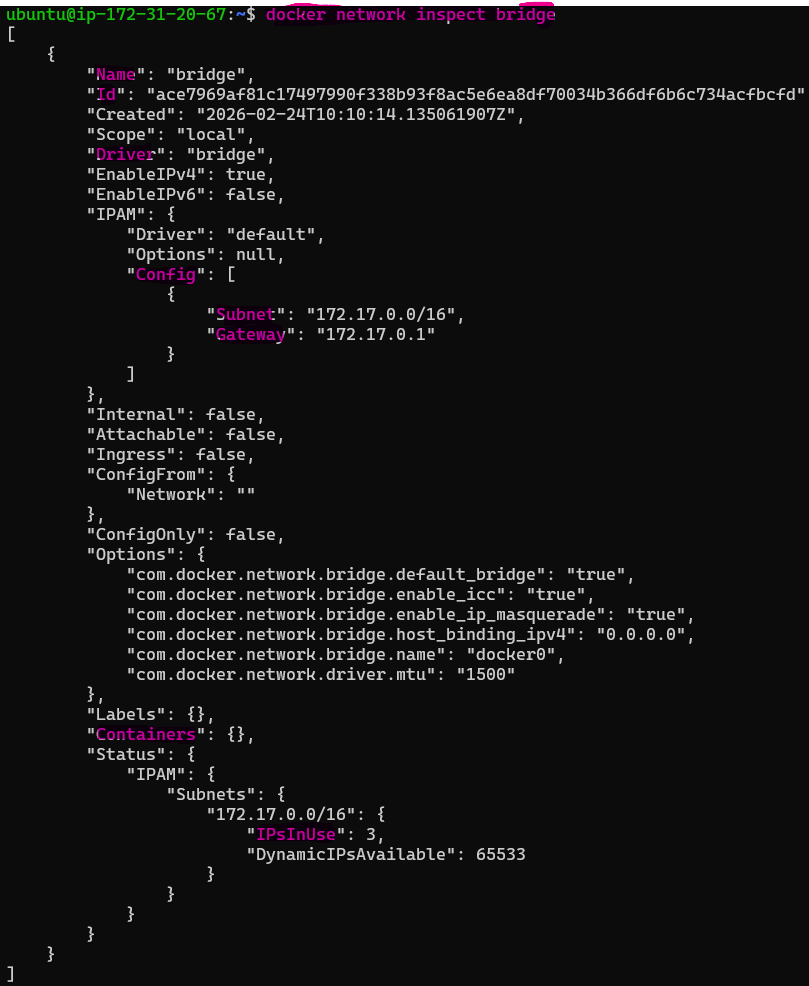

- `docker network inspect` is the command used to retrieve detailed configuration and status information about a specific Docker network.
- The `bridge network` is indeed the default network in Docker.

3. Run two containers on the default bridge — can they ping each other by **name**?

-   No
    
    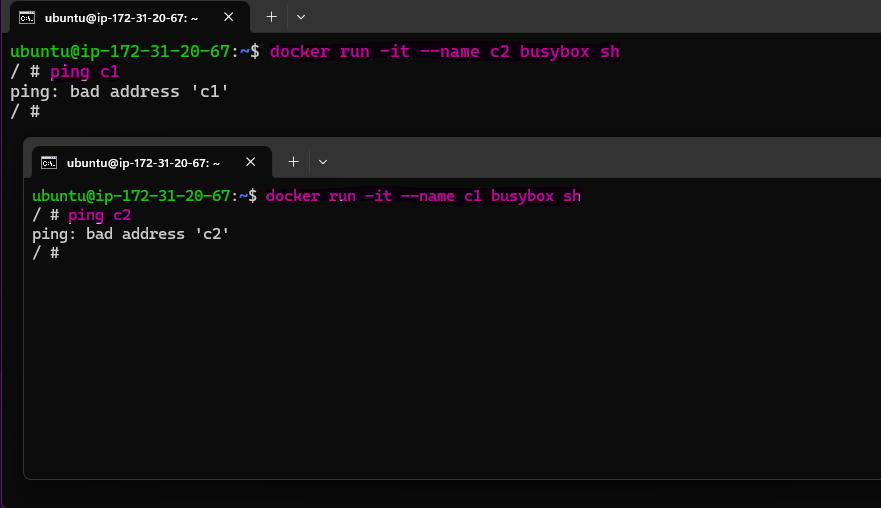

4. Run two containers on the default bridge — can they ping each other by **IP**?

-   Yes

    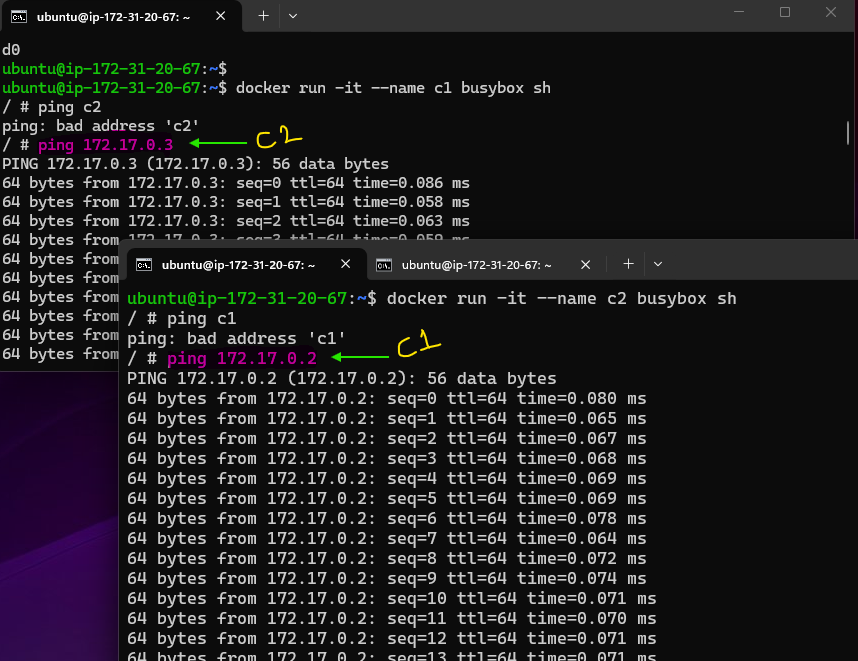

---

### Task 5: Custom Networks
1. Create a custom bridge network called `my-app-net`

    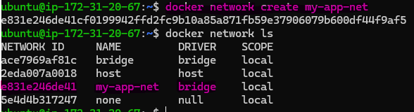

2. Run two containers on `my-app-net`
3. Can they ping each other by **name** now?

- `yes they can ping each other by name`

    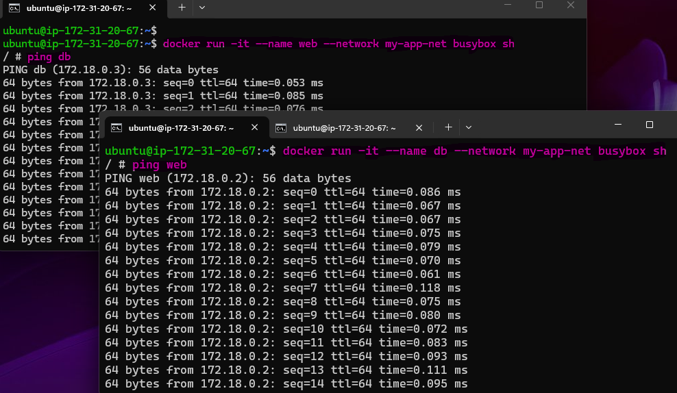

4. Why does custom networking allow name-based communication but the default bridge doesn't?

- Default Docker `bridge network` `does not have built-in DNS`,so containers cannot resolve each other by name.they need IPs.
- `User-defined networks` have `embedded DNS`, so containers can communicate using their names.

---

### Task 6: Put It Together
1. Create a custom network

    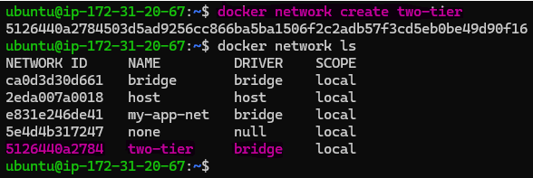

2. Run a **database container** (MySQL/Postgres) on that network with a volume for data
3. Run an **app container** (use any image) on the same network
4. Verify the app container can reach the database by container name

    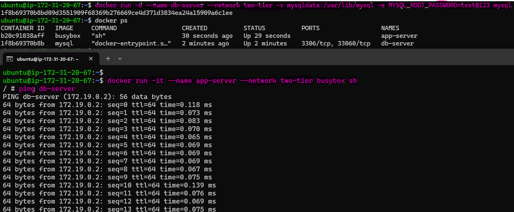

---