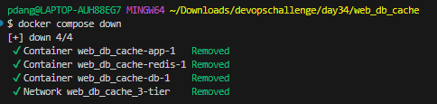
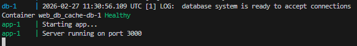
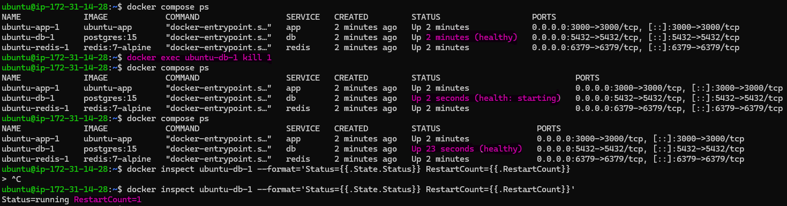
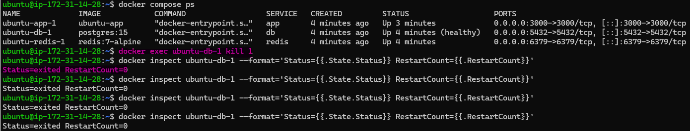
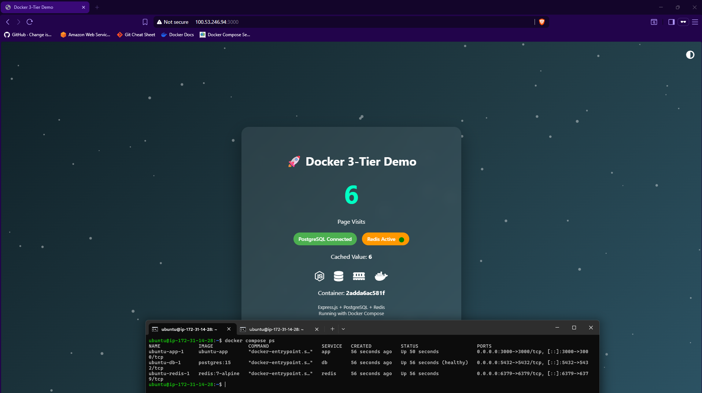
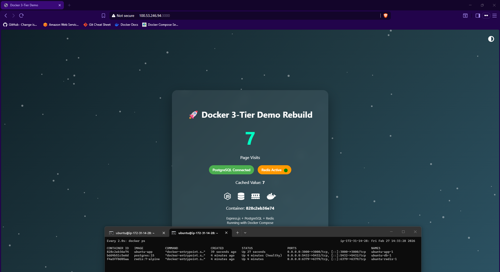
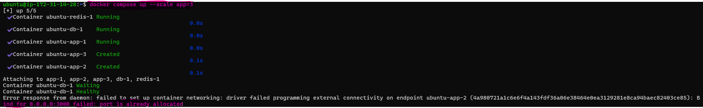
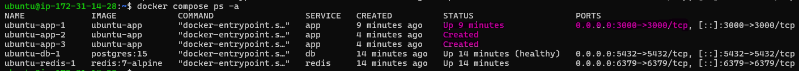

# Day 34 – Docker Compose: Real-World Multi-Container Apps

## Challenge Tasks

### Task 1: Build Your Own App Stack
Create a `docker-compose.yml` for a 3-service stack:
- A **web app** (use Python Flask, Node.js, or any language you know)
- A **database** (Postgres or MySQL)
- A **cache** (Redis)

    [Code](web_db_cache/)

---

### Task 2: depends_on & Healthchecks
1. Add `depends_on` to your compose file so the app starts **after** the database
2. Add a **healthcheck** on the database service
3. Use `depends_on` with `condition: service_healthy` so the app waits for the database to be truly ready, not just started

    **Test:** Bring everything down and up — does the app wait for the DB?

    - Yes

    

    

- Postgres container starts first.
- Healthcheck waits until DB is ready.
- App container starts only after DB is healthy.

---

### Task 3: Restart Policies
1. Add `restart: always` to your database service
2. Manually kill the database container — does it come back?
    - yes its back

    

3. Try `restart: on-failure` — how is it different?
    - no restart

    

4. When would you use each restart policy?

    - `restart:always` `Use When:`
            Databases,
            Backend APIs,
            Production services,
            Anything that must always run

    - `restart:on-failure` `Use When`:
            Data processing jobs
            One-time migration scripts
---

### Task 4: Custom Dockerfiles in Compose
1. Instead of using a pre-built image for your app, use `build:` in your compose file to build from a Dockerfile
2. Make a code change in your app
3. Rebuild and restart with one command

  [Dockerfile](web_db_cache/app/Dockerfile)

  

 

  [Compose](web_db_cache/docker-compose.yml)

---

### Task 5: Named Networks & Volumes
1. Define **explicit networks** in your compose file instead of relying on the default
2. Define **named volumes** for database data
3. Add **labels** to your services for better organization

  [Compose](web_db_cache/docker-compose.yml)

---

### Task 6: Scaling
1. Try scaling your web app to 3 replicas using `docker compose up --scale`
2. What happens? What breaks?
3. Why doesn't simple scaling work with port mapping?

    

    

    - First container started

    - It binds host port 3000 = container port 3000.

    - Second and third containers failed

    - Status Created means Docker couldn’t start them,port 3000 is already in use on the host.

    - Docker can’t bind multiple containers to the same host port.

---
