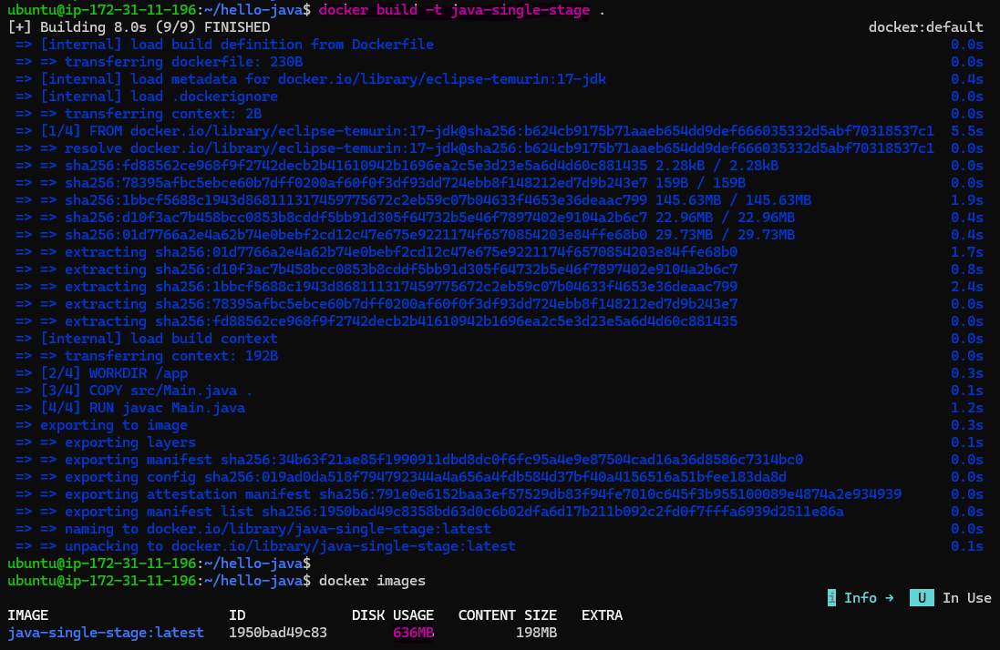
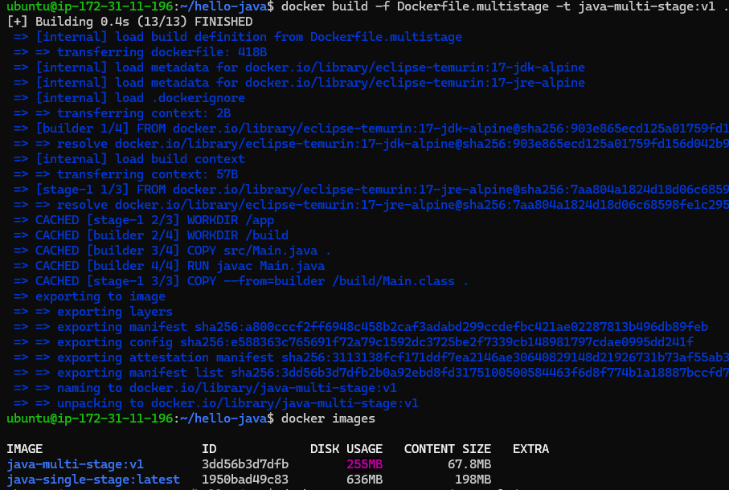
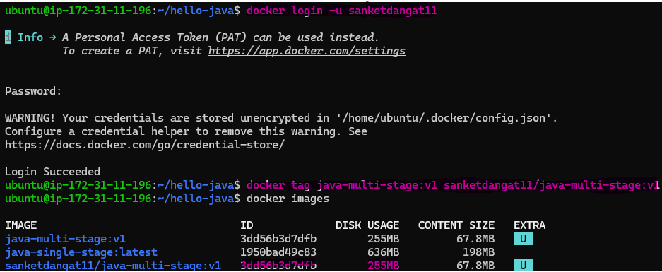
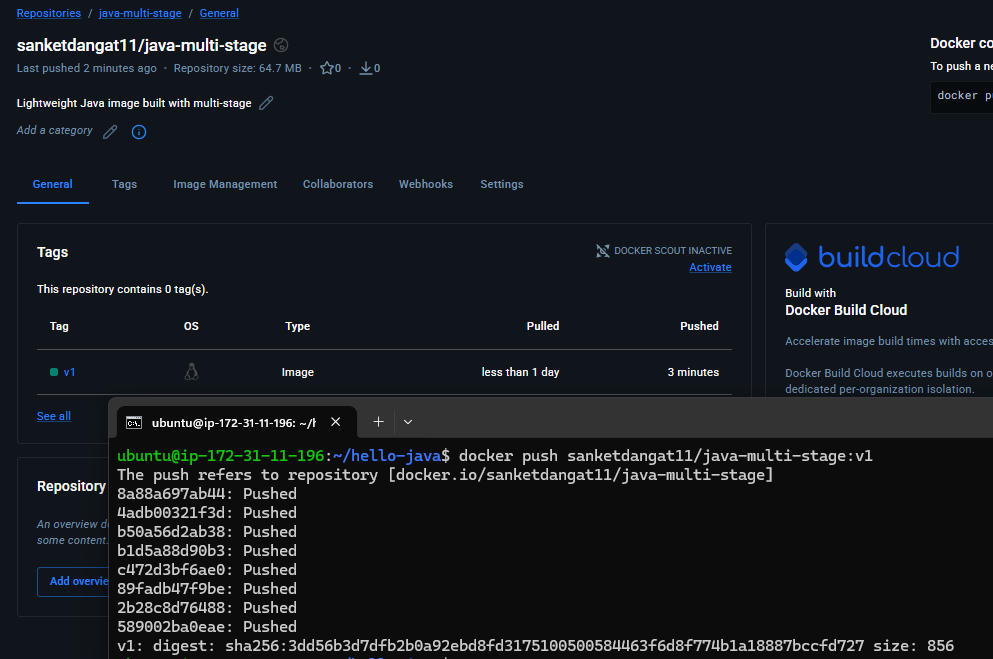
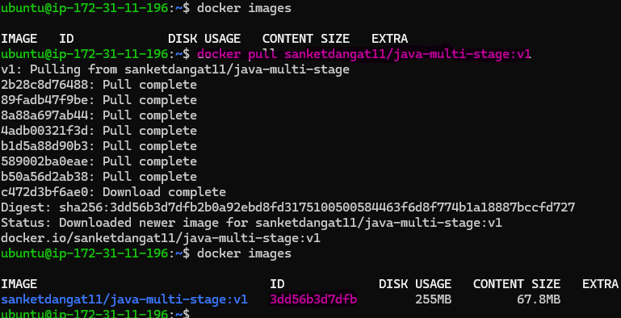
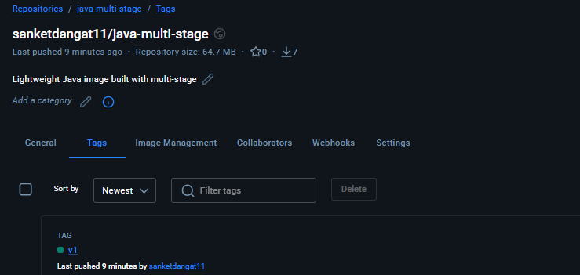
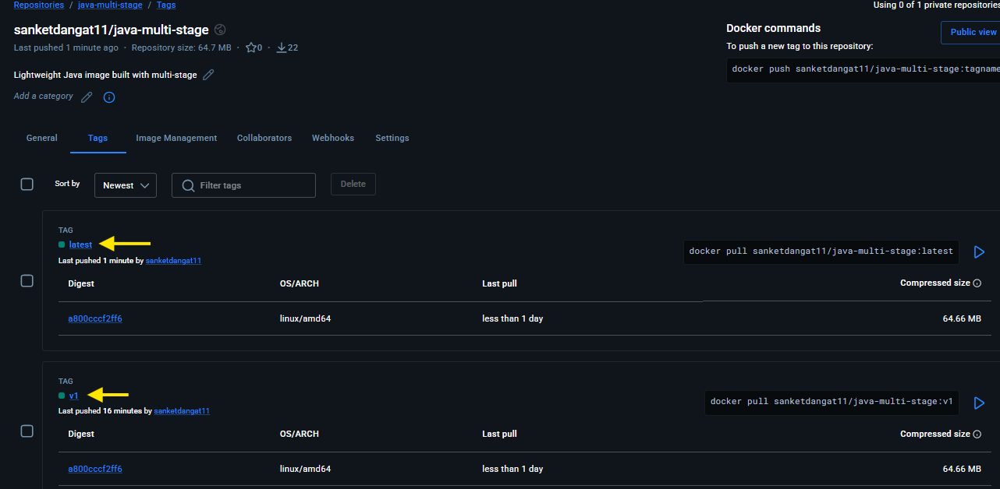

# Day 35 – Multi-Stage Builds & Docker Hub

## Challenge Tasks

### Task 1: The Problem with Large Images
1. Write a simple Go, Java, or Node.js app (even a "Hello World" is fine)
2. Create a Dockerfile that builds and runs it in a **single stage**
3. Build the image and check its **size**

   - Image Size is 638 MB

   

   [Dockerfile](hello-java/Dockerfile)

---

### Task 2: Multi-Stage Build
1. Rewrite the Dockerfile using **multi-stage build**:
   - Stage 1: Build the app (install dependencies, compile)
   - Stage 2: Copy only the built artifact into a minimal base image (`alpine`, `distroless`, or `scratch`)
2. Build the image and check its size again
3. Compare the two sizes

   - first image size is 638 MB
   - multi-stage image size is 255 MB

   

   [Dockerfile](hello-java/Dockerfile.multistage)

Why is the multi-stage image so much smaller?

- Multi-stage builds smaller images because they separate “build” from “runtime”, copying only what’s necessary into the final image.

---

### Task 3: Push to Docker Hub
1. Create a free account on [Docker Hub](https://hub.docker.com) (if you don't have one)
2. Log in from your terminal
3. Tag your image properly: `yourusername/image-name:tag`
4. Push it to Docker Hub
5. Pull it on a different machine (or after removing locally) to verify

   

   

   

---

### Task 4: Docker Hub Repository
1. Go to Docker Hub and check your pushed image
2. Add a **description** to the repository
3. Explore the **tags** tab — understand how versioning works
4. Pull a specific tag vs `latest` — what happens?

   - Specific tag (e.g., 1.0) = pulls that exact version of the image.
   - latest = pulls whatever image is currently marked latest, which can change

   

   

---

### Task 5: Image Best Practices
Apply these to one of your images and rebuild:
1. Use a **minimal base image** (alpine vs ubuntu — compare sizes)
2. **Don't run as root** — add a non-root USER in your Dockerfile
3. Combine `RUN` commands to **reduce layers**
4. Use **specific tags** for base images (not `latest`)

 [Dockerfile](hello-java/Dockerfile.final)

---

Dockehub link : https://hub.docker.com/repository/docker/sanketdangat11/java-multi-stage/