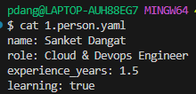
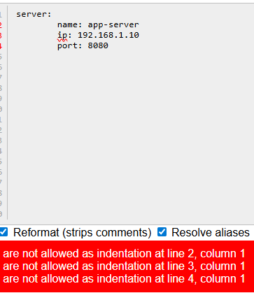
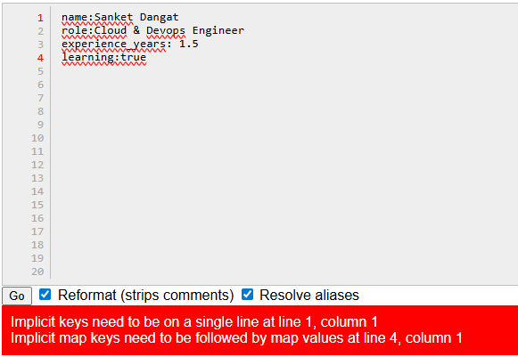
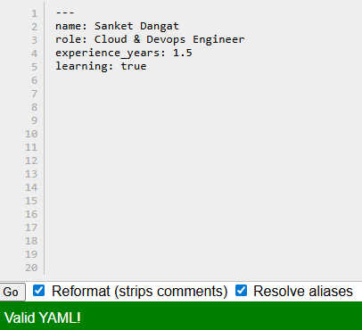

# Day 38 – YAML Basics
---

## Challenge Tasks

### Task 1: Key-Value Pairs
Create `person.yaml` that describes yourself with:
- `name`
- `role`
- `experience_years`
- `learning` (a boolean)

**Verify:** Run `cat person.yaml` — does it look clean? No tabs?

- It look clean, no tabs

    

    [person.yaml](yamls/person.yaml)

---

### Task 2: Lists
Add to `person.yaml`:
- `tools` — a list of 5 DevOps tools you know or are learning
- `hobbies` — a list using the inline format `[item1, item2]`

What are the two ways to write a list in YAML?

- Using `-` dash
- Using square brackets `[ ]` inline format


    [person.yaml](yamls/person.yaml)

---

### Task 3: Nested Objects
Create `server.yaml` that describes a server:
- `server` with nested keys: `name`, `ip`, `port`
- `database` with nested keys: `host`, `name`, `credentials` (nested further: `user`, `password`)

**Verify:** Try adding a tab instead of spaces — what happens when you validate it?

- Get error `Tabs are not allowed for indentation

    

    [server.yaml](yamls/server.yaml)

---

### Task 4: Multi-line Strings
In `server.yaml`, add a `startup_script` field using:
1. The `|` block style (preserves newlines)
2. The `>` fold style (folds into one line)

When would you use `|` vs `>`?

- `|` use when writing configuration files,multiple commands

- `>` use when Documentation text,descriptions

    [server2](yamls/server2.yaml)

---

### Task 5: Validate Your YAML
1. Install `yamllint` or use an online validator
2. Validate both your YAML files
3. Intentionally break the indentation — what error do you get?
4. Fix it and validate again

    

**get error**

- `Implicit keys need to be on a single line at line 1, column 1`
- `Implicit map keys need to be followed by map values at line 4, column 1`

**Fixed**



---

### Task 6: Spot the Difference
Read both blocks and write what's wrong with the second one:

```yaml
# Block 1 - correct
name: devops
tools:
  - docker
  - kubernetes
```

```yaml
# Block 2 - broken
name: devops
tools:
- docker
  - kubernetes
```


- In Block 2 Wrong indentation for the list item kubernetes
---

## Hints
- YAML uses **spaces only** — never tabs
- Indentation is everything — 2 spaces is standard
- Strings don't need quotes unless they contain special characters (`:`, `#`, etc.)
- `true`/`false` are booleans, `"true"` is a string
- Validate online: yamllint.com

---


**What I learned:**

- YAML uses key-value pairs,nested objects,and lists; always use spaces,never tabs.
- Lists can be dash (- item) or inline [item1, item2]
- Best Practices: Use 2 spaces per level.

---