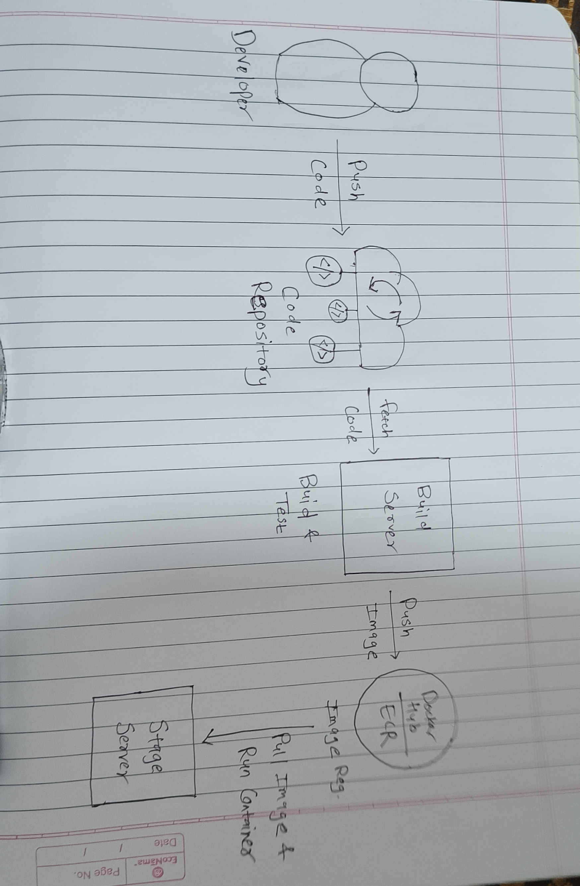

# Day 39 – What is CI/CD?

---

## Challenge Tasks

### Task 1: The Problem
Think about a team of 5 developers all pushing code to the same repo manually deploying to production.

1. What can go wrong?
- Merge conflicts when multiple developers push at the same time.
- Human errors in manual deployment steps (wrong server,wrong branch,missing files).
- Downtime or broken features if bugs are deployed.
- Difficulty rolling back if a deployment fails.

2. What does "it works on my machine" mean and why is it a real problem?
- Developers code run fine locally but fails in other environments.
- Causes:
    - Different OS,libraries or version installed.
    - Env.variables or configuration different
    - Missing dependencies that exists locally but not in other environments
- Problem: Leads to unexpected producton bugs and wasted debugging time.

3. How many times a day can a team safely deploy manually?
- Usually 1-2 times per day max for safety


---

### Task 2: CI vs CD

1. **Continuous Integration (CI)**

- What happens:
    - Developers frequently push code to a shared repository. 
    - CI tools (like Jenkins, GitHub Actions, GitLab CI/CD, or CircleCI) automatically build the code and run tests, providing instant feedback.

- How often:
    - Every time code is pushed—often multiple times per day.

- What it catches:
    - Compilation errors, failing tests, integration issues, and early bugs before they reach production.

- Real-world CI example (Hotstar):
    - Developers push code daily to the shared repository.
    - Jenkins automatically builds the app and runs tests for video playback, live scores, and UI features.
    - Any failing test triggers immediate feedback, so issues are fixed before merging, keeping Hotstar stable.

2. **Continuous Delivery (CD)**

- How it differs from CI:
    - Builds on CI by ensuring the software is always in a deployable state.
    - Code is automatically prepared for deployment but may require manual approval before release.

- What "delivery" means:
    - The application is always ready to release to production at any time.

- Real-world CD example (Netflix):
    - After passing CI tests, Netflix’s CD pipeline deploys the code to a staging environment.
    - With manual approval updates are then released to production,letting new features and fixes reach users safely and quickly.

3. **Continuous Deployment**

- How it differs from Continuous Delivery:
    - Every change that passes automated tests is automatically deployed to production without manual approval.

- When teams use it:
    - When high-frequency releases are required, and teams trust their automated testing and monitoring.

- Real-world example (Amazon):
    - Amazon deploys code multiple times per day directly to production, ensuring every successful build is live for users almost immediately.

---

### Task 3: Pipeline Anatomy

- **Trigger**
    - The event that starts the pipeline.
    - This could be a `code push`,`pull request`,`scheduled time` or `manual action`

- **Stage**
    - A logical phase in the pipeline.
    - Common stages include `build`, `test`and `deploy`. 
    - Stages help organize the workflow and often run in a defined order

- **Job**
    - A unit of work within a stage.
    - Each job runs independently and can contain multiple steps.
    - Example: a "Run Unit Tests" job inside the Test stage.

- **Steps**
    - A single command or action inside a job.
    - Steps are the building blocks of jobs like running a script,installing dependencies or executing tests.

- **Runner**
    - The machine (physical or virtual) that executes the job.
    - Runners provide the environment where all steps of a job actually run.

- **Artifact**
    - Any output produced by a job
    - The files or packages produced by a job (like a `.jar` file or `Docker image`) that are passed to later stages or saved for release.
---

### Task 4: Draw a Pipeline
Draw a CI/CD pipeline for this scenario:
> A developer pushes code to GitHub. The app is tested, built into a Docker image, and deployed to a staging server.


---

### Task 5: Explore in the Wild
1. Open any popular open-source repo on GitHub (Kubernetes, React, FastAPI — pick one you know)
2. Find their `.github/workflows/` folder
3. Open one workflow YAML file
4. Write in your notes:
   - What triggers it?
   - How many jobs does it have?
   - What does it do? (best guess)


https://github.com/fastapi/full-stack-fastapi-template/blob/master/.github/workflows/deploy-staging.yml


```
name: Deploy to Staging

on:
  push:
    branches:
      - master

jobs:
  deploy:
    # Do not deploy in the main repository, only in user projects
    if: github.repository_owner != 'fastapi'
    runs-on:
      - self-hosted
      - staging
    env:
      ENVIRONMENT: staging
      DOMAIN: ${{ secrets.DOMAIN_STAGING }}
      STACK_NAME: ${{ secrets.STACK_NAME_STAGING }}
      SECRET_KEY: ${{ secrets.SECRET_KEY }}
      FIRST_SUPERUSER: ${{ secrets.FIRST_SUPERUSER }}
      FIRST_SUPERUSER_PASSWORD: ${{ secrets.FIRST_SUPERUSER_PASSWORD }}
      SMTP_HOST: ${{ secrets.SMTP_HOST }}
      SMTP_USER: ${{ secrets.SMTP_USER }}
      SMTP_PASSWORD: ${{ secrets.SMTP_PASSWORD }}
      EMAILS_FROM_EMAIL: ${{ secrets.EMAILS_FROM_EMAIL }}
      POSTGRES_PASSWORD: ${{ secrets.POSTGRES_PASSWORD }}
      SENTRY_DSN: ${{ secrets.SENTRY_DSN }}
    steps:
      - name: Checkout
        uses: actions/checkout@v6
      - run: docker compose -f compose.yml --project-name ${{ secrets.STACK_NAME_STAGING }} build
      - run: docker compose -f compose.yml --project-name ${{ secrets.STACK_NAME_STAGING }} up -d
```

- Trigger
  - Runs on push to master branch

- Jobs
  - 1 job (deploy)

- What it does

    - Deploys the app to a staging environment

    - Runs on a self-hosted staging server

    - Uses environment secrets for configuration

    - Builds Docker containers

    - Starts the application with Docker Compose


---