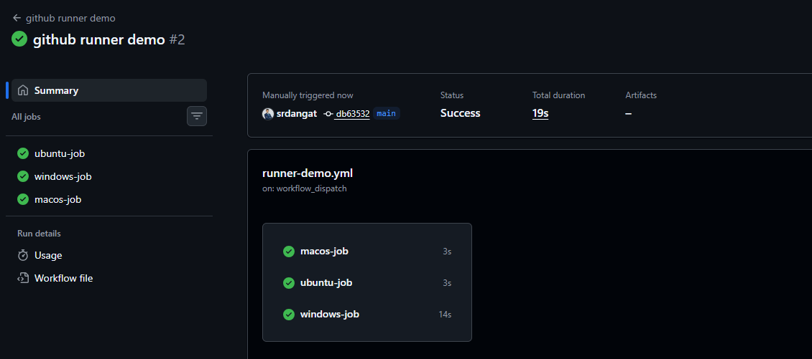
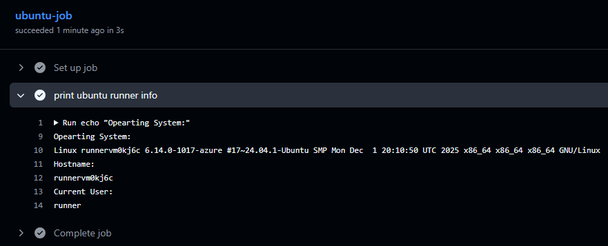
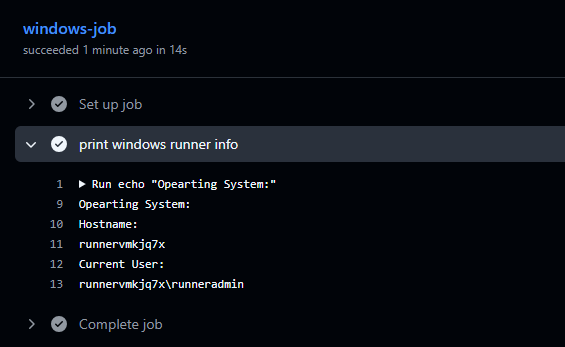
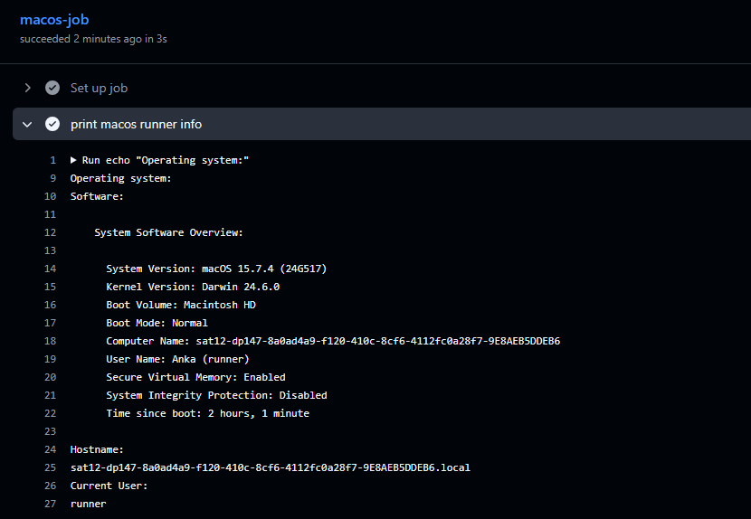
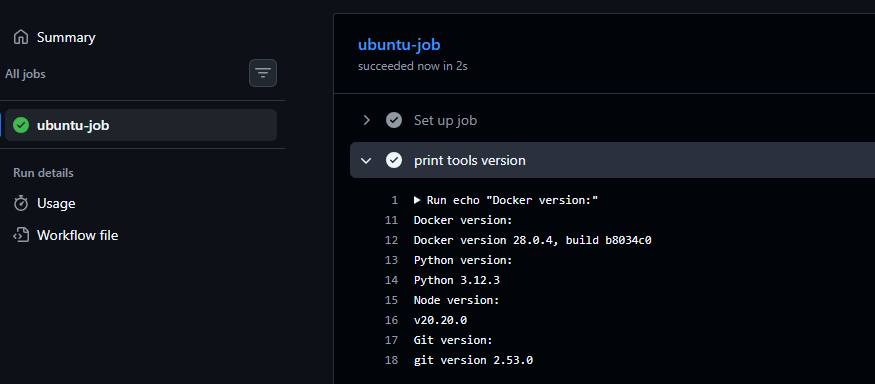
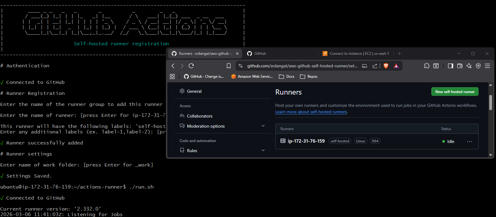
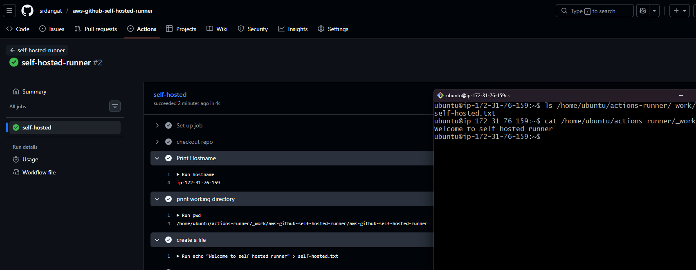
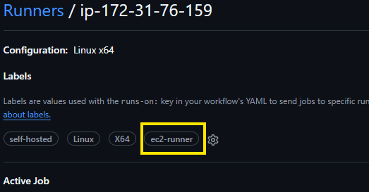
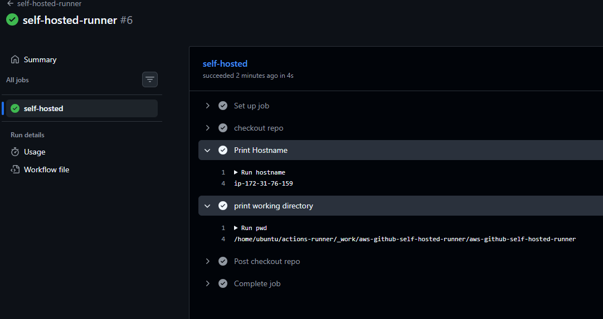

# Day 42 – Runners: GitHub-Hosted & Self-Hosted
---

## Challenge Tasks

### Task 1: GitHub-Hosted Runners
1. Create a workflow with 3 jobs, each on a different OS:
   - `ubuntu-latest`
   - `windows-latest`
   - `macos-latest`
2. In each job, print:
   - The OS name
   - The runner's hostname
   - The current user running the job
3. Watch all 3 run in parallel

    

    

    

    

    [GithubRunner](workflows/github-runner.yml)

    What is a GitHub-hosted runner? Who manages it?

    - `Github-hosted` runner is a temporary virtual machine provided by GitHub that runs GitHub Actions workflows.

    - `GitHub-hosted` runners are managed by GitHub on Microsoft Azure infrastructure.
    - Responsible for:
        - Creating the virtual machine
        - Installing software
        -  Maintaining security
        - Deleting the machine after the job completes.

---

### Task 2: Explore What's Pre-installed
1. On the `ubuntu-latest` runner, run a step that prints:
   - Docker version
   - Python version
   - Node version
   - Git version
2. Look up the GitHub docs for the full list of pre-installed software on `ubuntu-latest`

    

    [PreInsatlled](workflows/ubuntu-preinstall.yml)

    Why does it matter that runners come with tools pre-installed?

   - It matters because pre-installed tools make workflows faster and easier to configure. Developers can run builds and tests immediately without installing common tools like Docker, Python, Node.js, and Git, while GitHub maintains and updates the environment.
---

### Task 3: Set Up a Self-Hosted Runner
1. Go to your GitHub repo → Settings → Actions → Runners → **New self-hosted runner**
2. Choose Linux as the OS
3. Follow the instructions to download and configure the runner on:
   - Your local machine, OR
   - A cloud VM (EC2, Utho, or any VPS)
4. Start the runner — verify it shows as **Idle** in GitHub

**Verify:** Your runner appears in the Runners list with a green dot.

   

---

### Task 4: Use Your Self-Hosted Runner
1. Create `.github/workflows/ec2-hosted.yml`
2. Set `runs-on: self-hosted`
3. Add steps that:
   - Print the hostname of the machine (it should be YOUR machine/VM)
   - Print the working directory
   - Create a file and verify it exists on your machine after the run
4. Trigger it and watch it run on your own hardware

**Verify:** Check your machine — is the file there?
   - Yes,file is there

   

   

   [ec2-hosted](workflows/ec2-hosted.yml)

---

### Task 5: Labels
1. Add a **label** to your self-hosted runner (e.g., `my-linux-runner`)
2. Update your workflow to use `runs-on: [self-hosted, my-linux-runner]`
3. Trigger it — does it still pick up the job?

   

   

   Why are labels useful when you have multiple self-hosted runners?

   - Labels are useful when you have multiple self-hosted runners because they help GitHub Actions choose the correct runner for a specific job

---

### Task 6: GitHub-Hosted vs Self-Hosted
Fill this in your notes:

| | GitHub-Hosted | Self-Hosted |
|---|---|---|
| Who manages it? | Managed by Github | Managed by you |
| Cost | free for public repositories. For private repositories,costs depend on your GitHub plan and the runner's operating system | You pay for the infrastructure (server/VM like EC2) |
| Pre-installed tools | Many tools pre-installed (Docker,Node,Java,Python, etc.) | You install and manage the tools yourself |
| Good for | Quick setup, standard CI/CD workloads | Custom environments, private networks, heavy workloads|
| Security concern | Code runs on GitHub-managed infrastructure| You must secure and maintain the server yourself |

---
