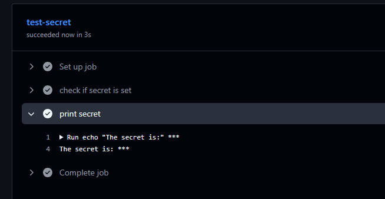
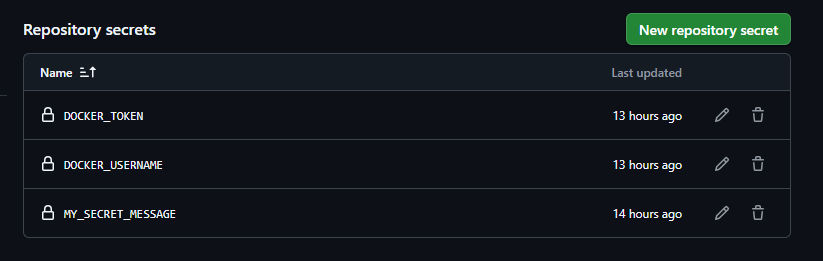
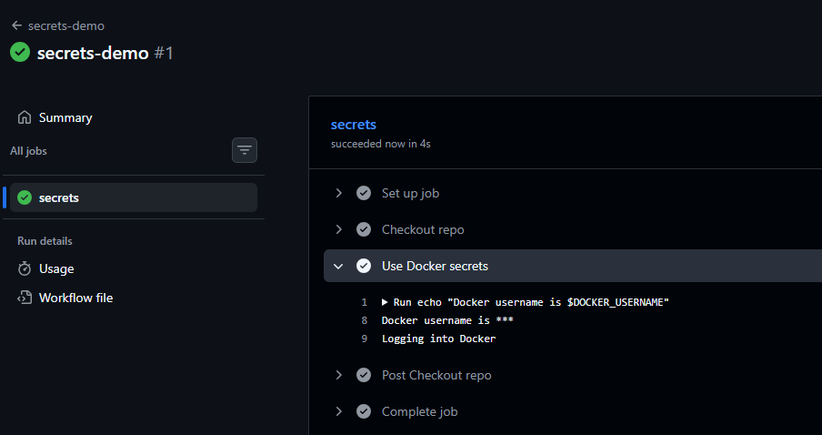
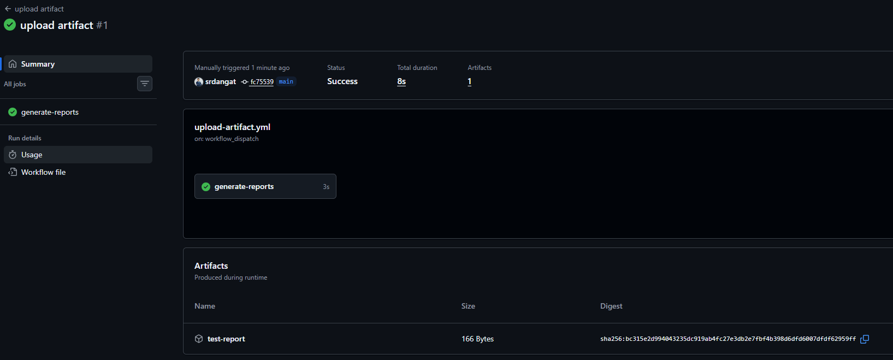
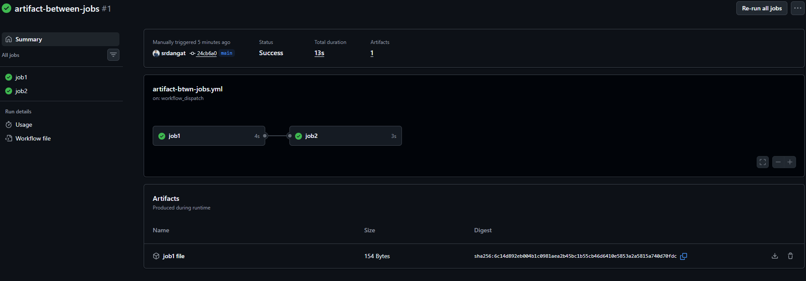
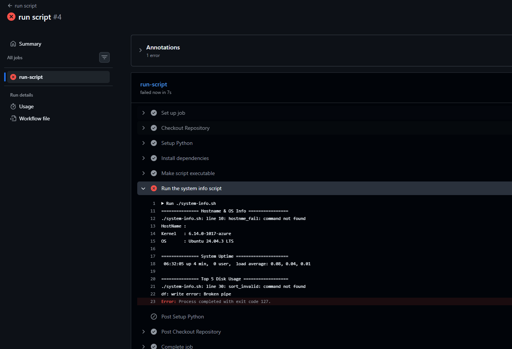
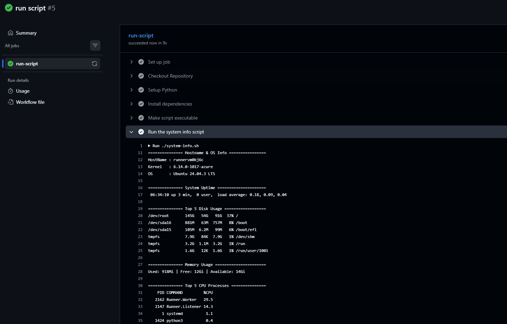
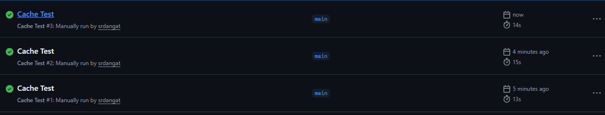

# Day 44 – Secrets, Artifacts & Running Real Tests in CI

## Challenge Tasks

### Task 1: GitHub Secrets
1. Go to your repo → Settings → Secrets and Variables → Actions
2. Create a secret called `MY_SECRET_MESSAGE`
3. Create a workflow that reads it and prints: `The secret is set: true` (never print the actual value)
4. Try to print `${{ secrets.MY_SECRET_MESSAGE }}` directly — what does GitHub show?

- GitHub automatically replaces secrets with ***

   

   

Why should you never print secrets in CI logs?

- CI logs are public or accessible to many team members.

- Printing secrets can expose API keys, tokens, or passwords.

   [Secrets](workflows/secrets.yml)

---

### Task 2: Use Secrets as Environment Variables
1. Pass a secret to a step as an environment variable
2. Use it in a shell command without ever hardcoding it
3. Add `DOCKER_USERNAME` and `DOCKER_TOKEN` as secrets (you'll need these on Day 45)

   

   

   [docker](workflows/docker-secrets.yml)

---

### Task 3: Upload Artifacts
1. Create a step that generates a file — e.g., a test report or a log file
2. Use `actions/upload-artifact` to save it
3. After the workflow runs, download the artifact from the Actions tab

   

   [upload-artifact](workflows/upload-articat.yml)

**Verify:** Can you see and download it from GitHub?

- Yes, I've seen it and downloaded it.

---

### Task 4: Download Artifacts Between Jobs
1. Job 1: generate a file and upload it as an artifact
2. Job 2: download the artifact from Job 1 and use it (print its contents)

   

   [artifacts](workflows/artifact-btwn-jobs.yml)

When would you use artifacts in a real pipeline?
- Artifacts are used to store and transfer files generated during pipelines.
- Test reports,

---

### Task 5: Run Real Tests in CI
Take any script from your earlier days (Python or Shell) and run it in CI:
1. Add your script to the `github-actions-practice` repo
2. Write a workflow that:
   - Checks out the code
   - Installs any dependencies needed
   - Runs the script
   - Fails the pipeline if the script exits with a non-zero code
3. Intentionally break the script — verify the pipeline goes red
4. Fix it — verify it goes green again

   

   

   [Test](workflows/test.yml)

---

### Task 6: Caching
1. Add `actions/cache` to a workflow that installs dependencies
2. Run it twice — observe the time difference
3. Write in your notes: What is being cached and where is it stored?

   

   [cache](workflows/cache.yml)

- What is cached: Python packages downloaded by pip from requirements.txt.
- Where it’s stored: On GitHub Actions servers,restored to the runner at ~/.cache/pip.

---

 **What I lerned from Secret Management**

- Store sensitive data (like API keys, tokens, passwords) in GitHub Actions Secrets, not in code.
- They are encrypted, injected at runtime, and never exposed in logs.