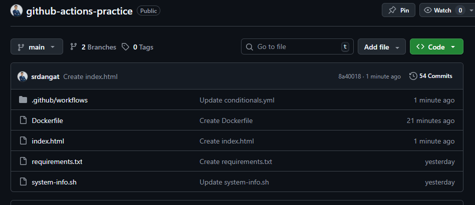
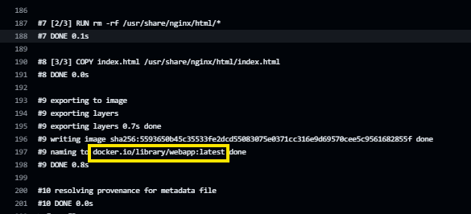
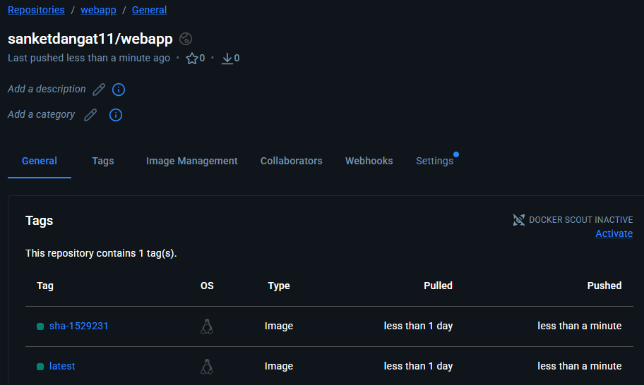
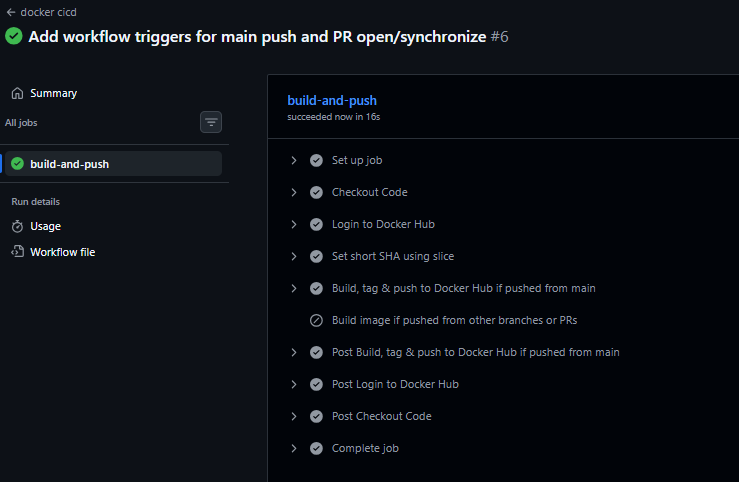
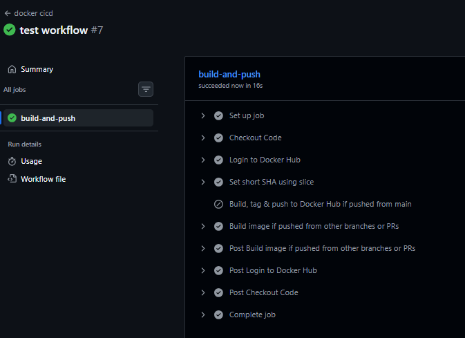
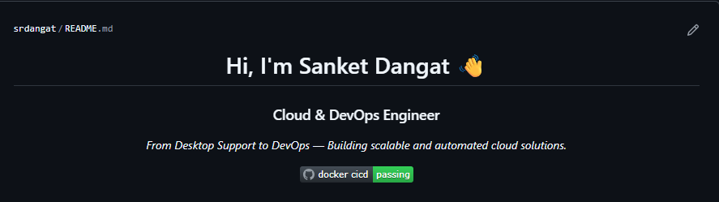
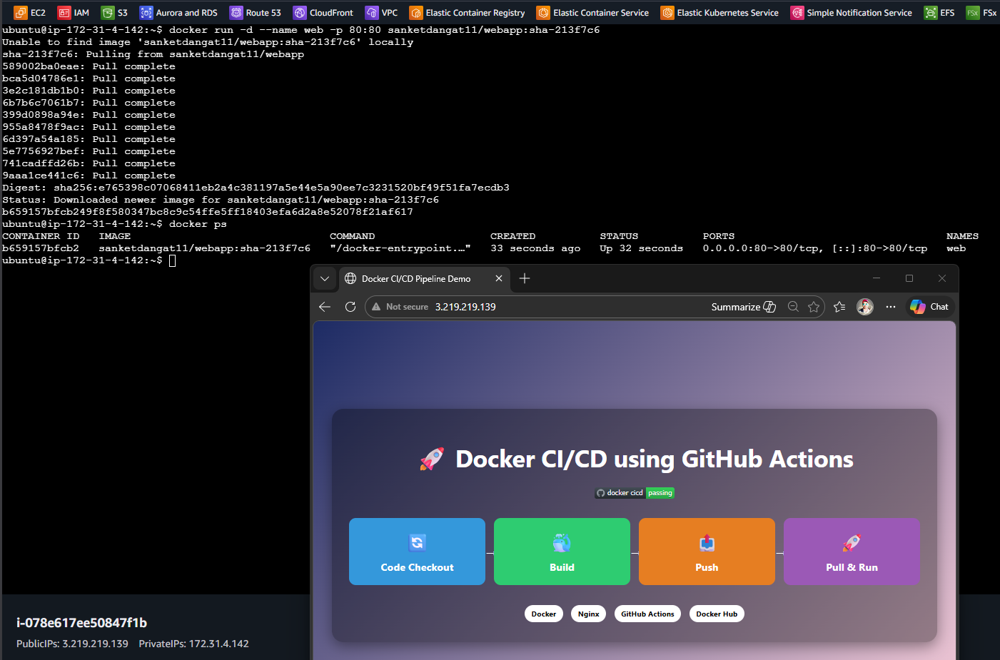

# Day 45 – Docker Build & Push in GitHub Actions

## Challenge Tasks

### Task 1: Prepare
1. Use the app you Dockerized on Day 36 (or any simple Dockerfile)
2. Add the Dockerfile to your `github-actions-practice` repo (or create a minimal one)
3. Make sure `DOCKER_USERNAME` and `DOCKER_TOKEN` secrets are set from Day 44

    

---

### Task 2: Build the Docker Image in CI
Create `.github/workflows/docker-publish.yml` that:
1. Triggers on push to `main`
2. Checks out the code
3. Builds the Docker image and tags it

**Verify:** Check the build step logs — does the image build successfully?

Yes,image build successfully

---

### Task 3: Push to Docker Hub
Add steps to:
1. Log in to Docker Hub using your secrets
2. Tag the image as `username/repo:latest` and also `username/repo:sha-<short-commit-hash>`
3. Push both tags

**Verify:** Go to Docker Hub — is your image there with both tags?

    - Yes, both tags are in Dockerhub

---

### Task 4: Only Push on Main
Add a condition so the push step only runs on the `main` branch — not on feature branches or PRs.

Test it: push to a feature branch and verify the image is built but NOT pushed.

On the main branch, the image was built and pushed to Docker Hub

On the feature-test branch, the image was built and the push step was skipped.

---

### Task 5: Add a Status Badge
1. Get the badge URL for your `docker-publish` workflow from the Actions tab
2. Add it to your `README.md`
3. Push — the badge should show green

    
---

### Task 6: Pull and Run It
1. On your local machine (or a cloud server), pull the image you just pushed
2. Run it
3. Confirm it works

[Docker-Hub](https://hub.docker.com/repository/docker/sanketdangat11/webapp/general)

Yes,its woking

What is the full journey from `git push` to a running container?

1. git push – Code is pushed to GitHub.

2. GitHub Actions triggers – The CI/CD workflow starts.

3. Checkout code: `uses: actions/checkout@v4`

4. Login to Docker Hub: `uses: docker/login-action@v3`

5. Build Docker image using the Dockerfile.
    - If code is pushed to main: Docker image is built, tagged, and pushed to Docker Hub.
    - If pushed to other branches or PRs:Docker image is only built for testing.It is not pushed to Docker Hub.

6. Run the container: `docker run -d --name web -p 80:80 sanketdangat11/webapp:latest`