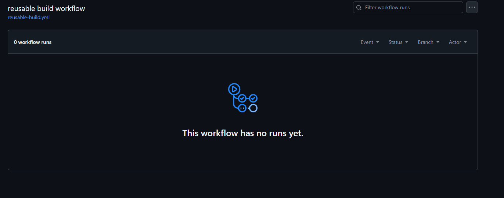
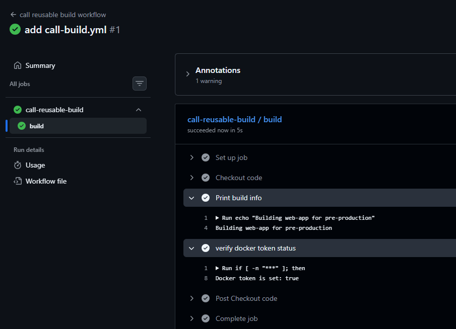
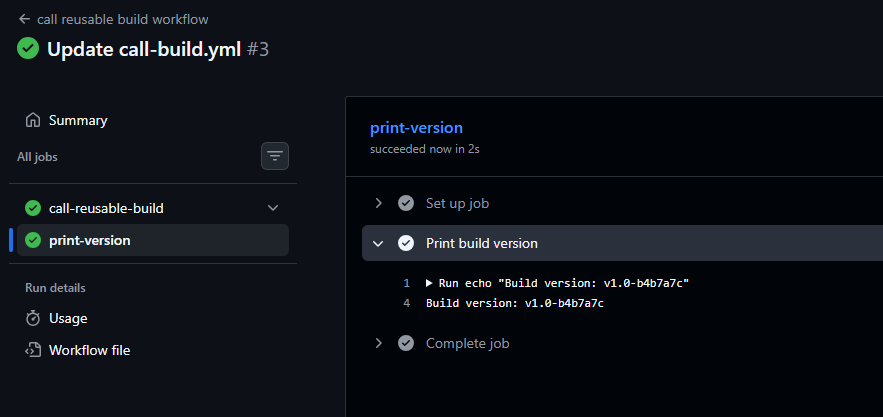
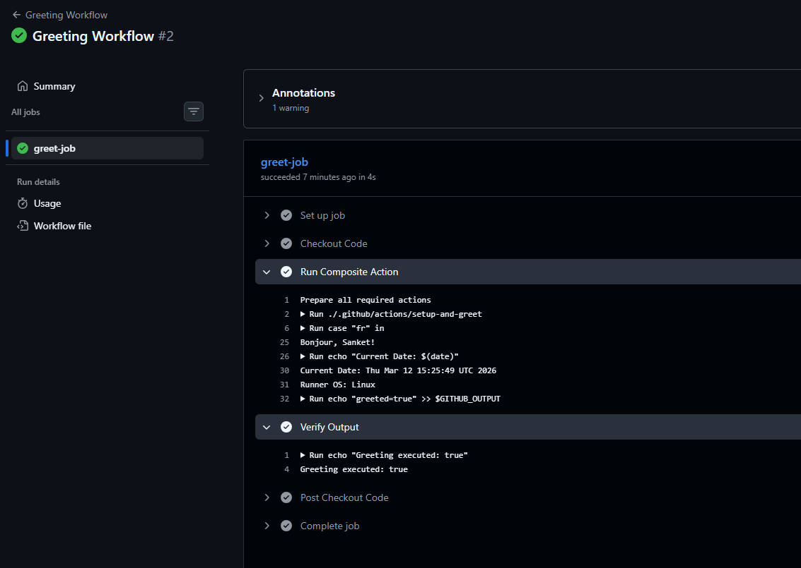

# Day 46 – Reusable Workflows & Composite Actions

## Challenge Tasks

### Task 1: Understand `workflow_call`
1. What is a **reusable workflow**?

- A `reusable workflow` is a GitHub Actions workflow that can be called from another workflow,allowing you to reuse the same automation logic across multiple workflows.


2. What is the `workflow_call` trigger?

- `workflow_call` is a GitHub Actions trigger that allows a workflow to be executed by another workflow instead of events like push or pull_request.

3. How is calling a reusable workflow different from using a regular action (`uses:`)?

- `Reusable Workflow` is used at the workflow level and written inside `jobs.<job_id>.uses.` It is used to reuse a complete workflow with jobs and steps,for example calling a build pipeline.
- `Regular Action` is used at the `step level` and written inside `steps.uses`. It is used to reuse a single task,for example checking out code or running Docker.


4. Where must a reusable workflow file live?

- It must be inside the folder: `.github/workflows/`

---

### Task 2: Create Your First Reusable Workflow
Create `.github/workflows/reusable-build.yml`:
1. Set the trigger to `workflow_call`
2. Add an `inputs:` section with:
   - `app_name` (string, required)
   - `environment` (string, required, default: `staging`)
3. Add a `secrets:` section with:
   - `docker_token` (required)
4. Create a job that:
   - Checks out the code
   - Prints `Building <app_name> for <environment>`
   - Prints `Docker token is set: true` (never print the actual secret)

**Verify:** This file alone won't run — it needs a caller. That's next.

   

   [reusable-workflow](workflows/reusable-build.yml)

---

### Task 3: Create a Caller Workflow
Create `.github/workflows/call-build.yml`:
1. Trigger on push to `main`
2. Add a job that uses your reusable workflow:
   ```yaml
   jobs:
     build:
       uses: ./.github/workflows/reusable-build.yml
       with:
         app_name: "my-web-app"
         environment: "production"
       secrets:
         docker_token: ${{ secrets.DOCKER_TOKEN }}
   ```
3. Push to `main` and watch it run

**Verify:** In the Actions tab, do you see the caller triggering the reusable workflow? Click into the job — can you see the inputs printed?

- Yes caller triggering the reusable workflow and also inputs printed


   

  [caller-workflow](workflows/call-build.yml)

---

### Task 4: Add Outputs to the Reusable Workflow
Extend `reusable-build.yml`:
1. Add an `outputs:` section that exposes a `build_version` value
2. Inside the job, generate a version string (e.g., `v1.0-<short-sha>`) and set it as output
3. In your caller workflow, add a second job that:
   - Depends on the build job (`needs:`)
   - Reads and prints the `build_version` output

**Verify:** Does the second job print the version from the reusable workflow?

   - Yes,second job print the version from the reusable workflow

   

   [reusable](workflows/reusable-build.yml)

---

### Task 5: Create a Composite Action
Create a **custom composite action** in your repo at `.github/actions/setup-and-greet/action.yml`:
1. Define inputs: `name` and `language` (default: `en`)
2. Add steps that:
   - Print a greeting in the specified language
   - Print the current date and runner OS
   - Set an output called `greeted` with value `true`
3. Use the composite action in a new workflow with `uses: ./.github/actions/setup-and-greet`

**Verify:** Does your custom action run and print the greeting?

   - Yes,custom action run and print the greeting

      

      [action](workflows/action.yml)

      [greet](workflows/greet.yml)
---

### Task 6: Reusable Workflow vs Composite Action
Fill this in your notes:

| | Reusable Workflow | Composite Action |
|---|---|---|
| Triggered by | `workflow_call` | `uses:` in a step |
| Can contain jobs? | Yes | No |
| Can contain multiple steps? | Yes | Yes |
| Lives where? | .github/workflows/ | .github/actions/ |
| Can accept secrets directly? | Yes | No |
| Best for | Reusing full workflows| Reusing small step groups |

---