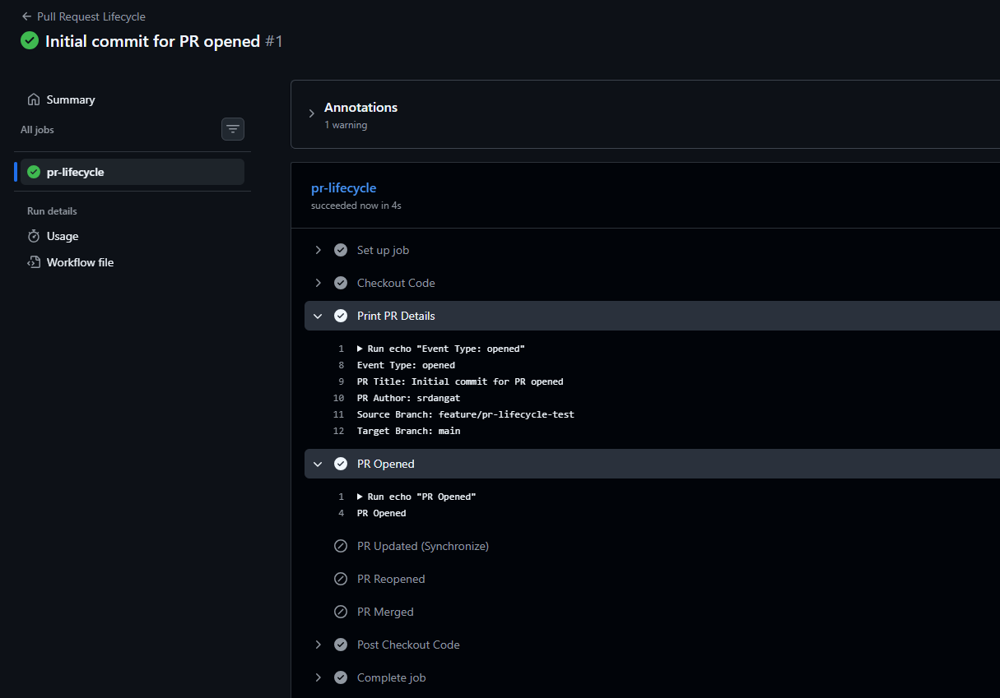
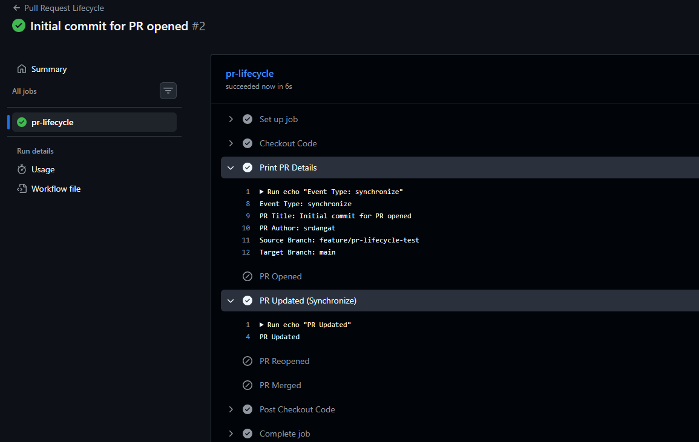
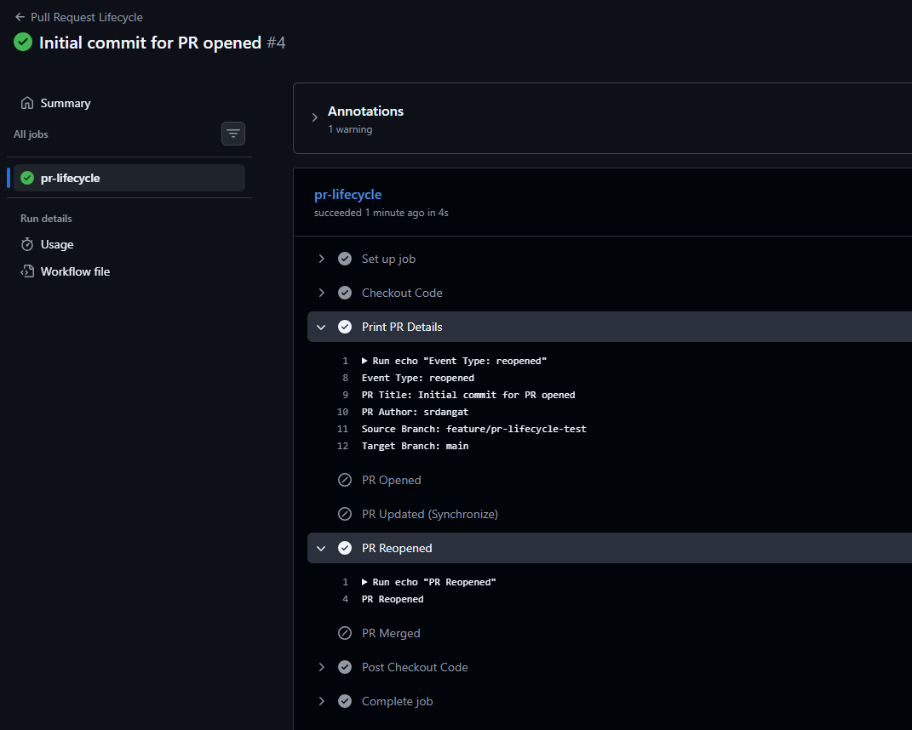
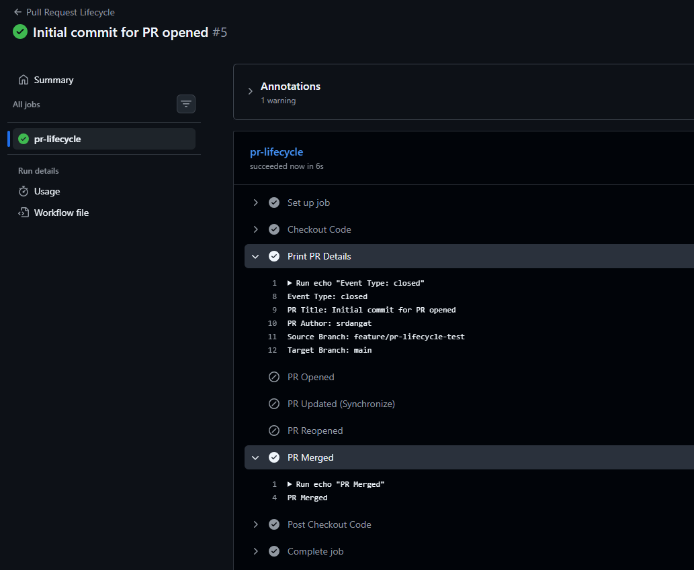
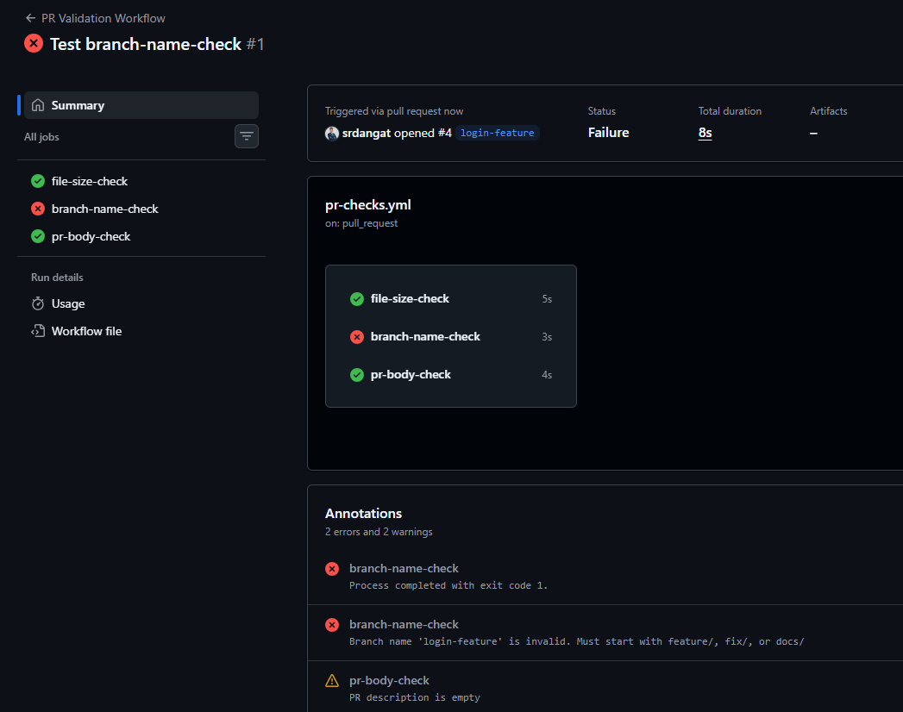
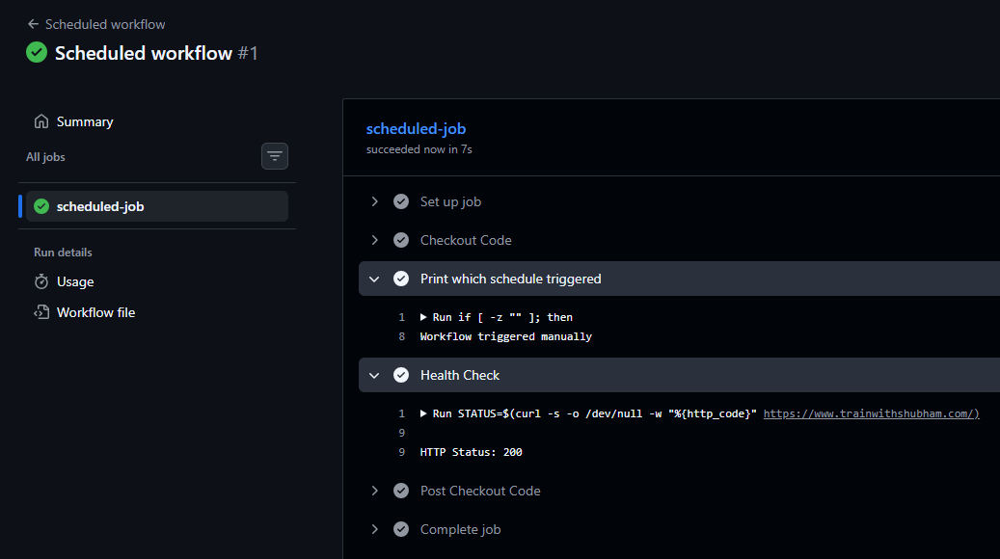
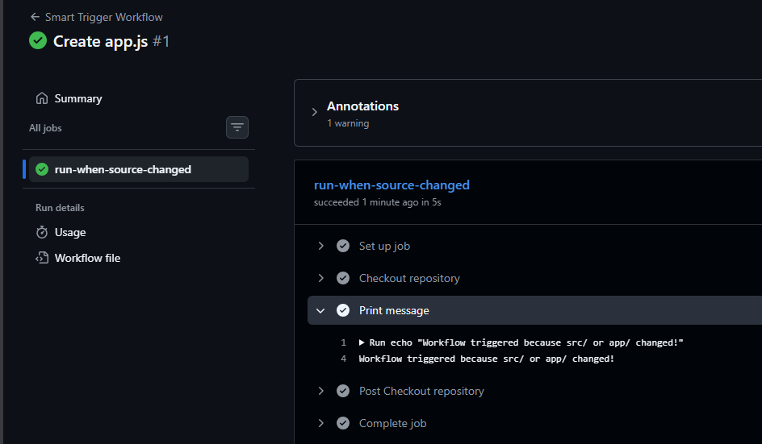
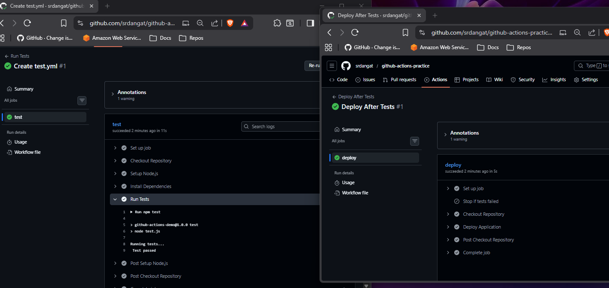
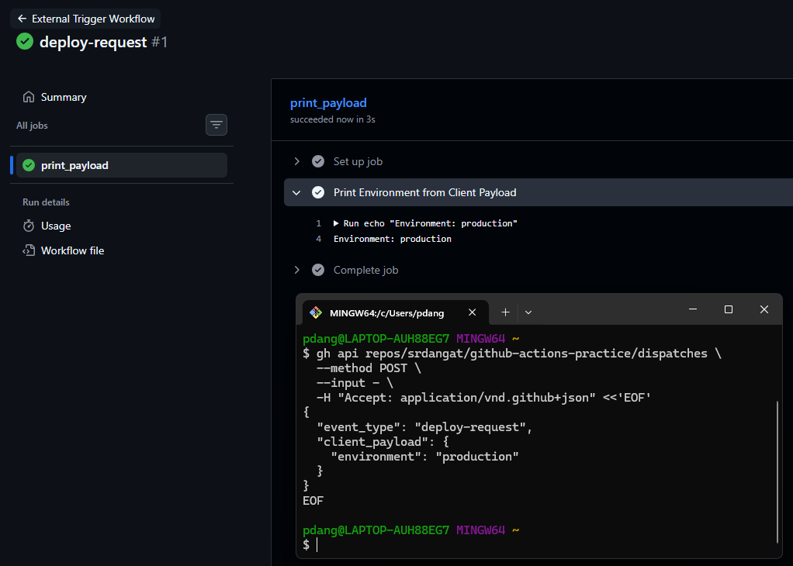

# Day 47 – Advanced Triggers: PR Events, Cron Schedules & Event-Driven Pipelines

## Challenge Tasks

### Task 1: Pull Request Event Types
Create `.github/workflows/pr-lifecycle.yml` that triggers on `pull_request` with **specific activity types**:
1. Trigger on: `opened`, `synchronize`, `reopened`, `closed`
2. Add steps that:
   - Print which event type fired: `${{ github.event.action }}`
   - Print the PR title: `${{ github.event.pull_request.title }}`
   - Print the PR author: `${{ github.event.pull_request.user.login }}`
   - Print the source branch and target branch
3. Add a conditional step that only runs when the PR is **merged** (closed + merged = true)

Test it: create a PR, push an update to it, then merge it. Watch the workflow fire each time with a different event type.

   


   


   


   


   [PR-Lifecycle](workflows/pr-lifecycle.yml)

---

### Task 2: PR Validation Workflow
Create `.github/workflows/pr-checks.yml` — a real-world PR gate:
1. Trigger on `pull_request` to `main`
2. Add a job `file-size-check` that:
   - Checks out the code
   - Fails if any file in the PR is larger than 1 MB
3. Add a job `branch-name-check` that:
   - Reads the branch name from `${{ github.head_ref }}`
   - Fails if it doesn't follow the pattern `feature/*`, `fix/*`, or `docs/*`
4. Add a job `pr-body-check` that:
   - Reads the PR body: `${{ github.event.pull_request.body }}`
   - Warns (but doesn't fail) if the PR description is empty

**Verify:** Open a PR from a badly named branch — does the check fail?

 - Yes,the branch-name-check job fails


   


   [PR-Checks](workflows/pr-checks.yml)

---

### Task 3: Scheduled Workflows (Cron Deep Dive)
Create `.github/workflows/scheduled-tasks.yml`:
1. Add a `schedule` trigger with cron: `'30 2 * * 1'` (every Monday at 2:30 AM UTC)
2. Add **another** cron entry: `'0 */6 * * *'` (every 6 hours)
3. In the job, print which schedule triggered using `${{ github.event.schedule }}`
4. Add a step that acts as a **health check** — curl a URL and check the response code


   

Write in your notes:
- The cron expression for: every weekday at 9 AM IST: `0 3 * * 1-5`
- The cron expression for: first day of every month at midnight: `0 0 1 * *`
- Why GitHub says scheduled workflows may be delayed or skipped on inactive repos
   - Scheduled workflows run on shared runners and only on the default branch.
   - GitHub may delay/skip schedules on inactive repositories to save resources.


---

### Task 4: Path & Branch Filters
Create `.github/workflows/smart-triggers.yml`:
1. Trigger on push but **only** when files in `src/` or `app/` change:
   ```yaml
   on:
     push:
       paths:
         - 'src/**'
         - 'app/**'
   ```
2. Add `paths-ignore` in a second workflow that skips runs when only docs change:
   ```yaml
   paths-ignore:
     - '*.md'
     - 'docs/**'
   ```
3. Add branch filters to only trigger on `main` and `release/*` branches
4. Test it: push a change to a `.md` file — does the workflow skip?

   - Yes,Workflow skip

      


      [SmartTrigger](workflows/smart-triggers.yml)


      [PathIgnore](workflows/ignore-docs.yml)


 When would you use `paths` vs `paths-ignore`?

   - Use `paths` when you want the workflow to run only if specific files or folders change.

   - Use `paths-ignore` when the workflow should run for most changes but skip certain files.


---

### Task 5: `workflow_run` — Chain Workflows Together
Create two workflows:
1. `.github/workflows/tests.yml` — runs tests on every push
2. `.github/workflows/deploy-after-tests.yml` — triggers **only after** `tests.yml` completes successfully:
   ```yaml
   on:
     workflow_run:
       workflows: ["Run Tests"]
       types: [completed]
   ```
3. In the deploy workflow, add a conditional:
   - Only proceed if the triggering workflow **succeeded** (`${{ github.event.workflow_run.conclusion == 'success' }}`)
   - Print a warning and exit if it failed

**Verify:** Push a commit — does the test workflow run first, then trigger the deploy workflow?

   - Yes,test workflow run first ,then trigger the deploy workflows.


      


      [Test](workflows/tests.yml)


      [DeplyAfterTest](workflows/deploy-after-tests.yml)


---

### Task 6: `repository_dispatch` — External Event Triggers
1. Create `.github/workflows/external-trigger.yml` with trigger `repository_dispatch`
2. Set it to respond to event type: `deploy-request`
3. Print the client payload: `${{ github.event.client_payload.environment }}`
4. Trigger it using `curl` or `gh`:
   ```bash
      gh api repos/srdangat/github-actions-practice/dispatches \
      --method POST \
      --input - \
      -H "Accept: application/vnd.github+json" <<'EOF'
      {
      "event_type": "deploy-request",
      "client_payload": {
         "environment": "production"
      }
      }
      EOF
   ```

      

      [External](workflows/external-trigger.yml)

   When would an external system (like a Slack bot or monitoring tool) trigger a pipeline?

   An external system (like a Slack bot or monitoring tool) would trigger a pipeline when an event outside GitHub needs a workflow to run, such as:
   - A Slack bot sending a deploy request to start deployment.
   - A monitoring tool detecting an error and triggering a fix workflow.
   - One repository finishing work and notifying another repository to run a workflow.

---


`workflow_call`
   - Makes a workflow reusable, like a function.
   - One workflow calls another directly.
   - Can pass inputs and secrets.
   - `Example`: `deploy.yml` calls `test.yml` before deploying.

`workflow_run`
   - Triggers a workflow after another workflow finishes.
   - Runs automatically based on workflow completion and status.
   - No input passing.
   - `Example`: `deploy.yml` runs only `after tests succeed`.

---